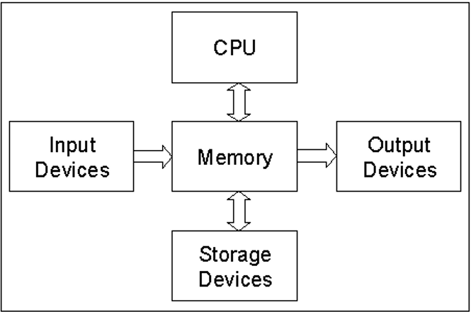
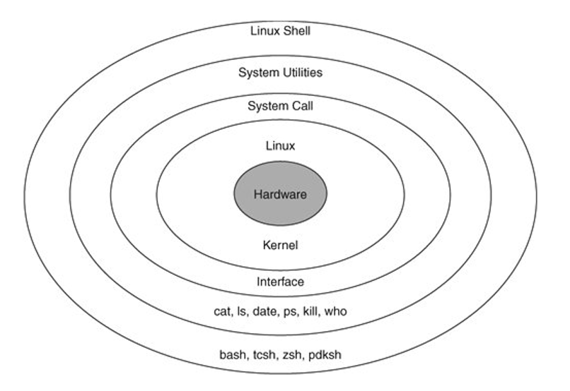
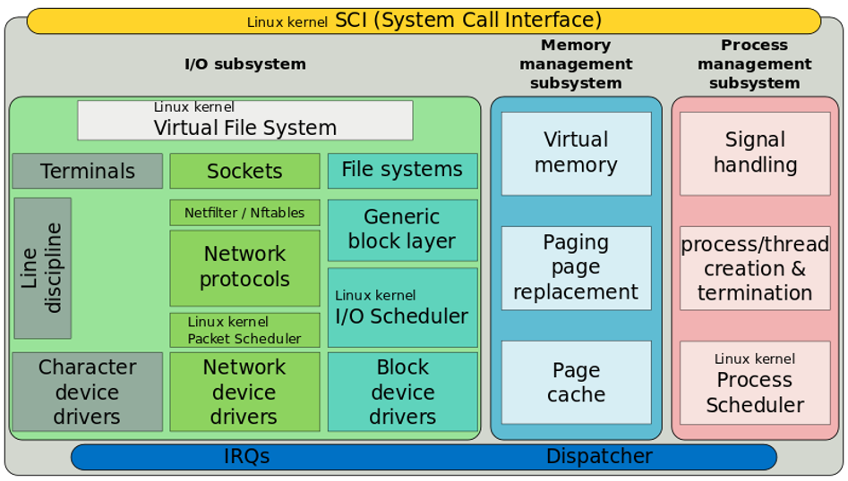
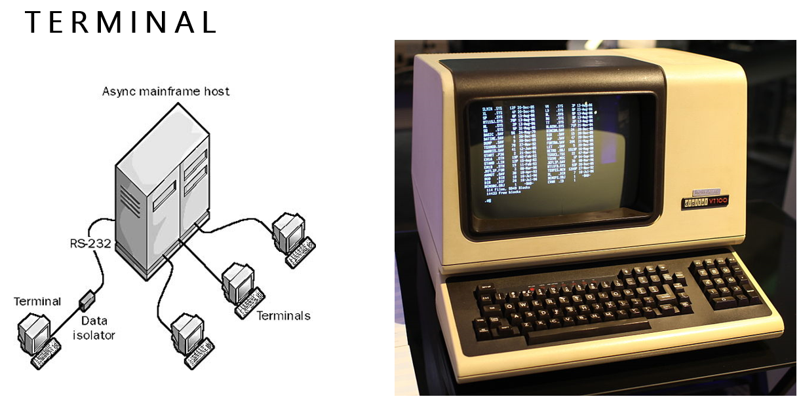
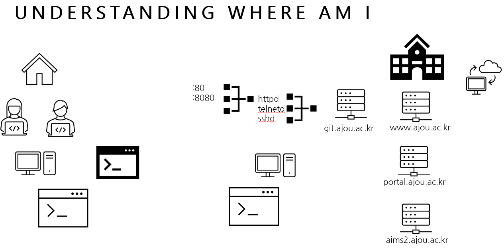

# Computer System
    - 일반적으로 4가지 요소로 구성
        - User (Human computer Interface ...)
        - Hardware (디지털 회로, 컴퓨터 구조...)
        - Software (운영체제, 데이터베이스, 시스템프로그래밍 ...)
        - Data(Infomation)

## Hardware System 
    - (화살표 중요)

        

    - CPU(인텔, AMD)
    - Memory(RAM)
        - volatile
    - Storage Device (HDD, SSD) : 메모리로 옮기고 받는게 모두 가능
    - Input Devices, Output Devices

## Software
    - hardware를 잘 쓰기위해 존재
    - System Software (시스템 소프트웨어)
        - OS (윈도우, 유닉스, 리눅스 ...)
        - DB
        - 컴파일러
    - Application Software (응용 소프트웨어)    
    - shell 밖은 User
        
        

        - Linux OS에서 User는 직접 Hardware에 System call을 통해 접근할 수 있을까? X
            - System Utilities와 커널의 도움을 받아야한다
            - 계층적인 구조로 접근해야한다
        - Git SCM 설치 -> HD를 제외한 모든 것이 설치된다 (리눅스의 MINGW)
        - System call : C언어로 짜인 함수
            - 리눅스 시스템에 C컴파일러가 항상 들어있다.(사용자가 쓸 수 없도록 내부에 존재)
        - System Utilities : System call interface를 써서 만든 명령어들
        - Kernel

            

            - 운영체제가 SCI로 subsystem을 통해 하드웨어 구조를 조작
            - 즉, 커널이 하드웨어를 관리
            - I/O subsystem
                - Terminals, Socket, File system
                - device의 3종류 
                    - character device drivers
                        - ex) Terminal

                            

                            - 현재는 선이 없는 형태(인터넷)
                            - Console :  terminal중 system에 직접 붙어있어서 특별한 제어가능
                            - 입출력 장치의 default 값 => C의 #include<stdio.h>
                            - 따라서, shell -> ... -> kernel -> terminal -> 입출력
                            - GUI vs CUI
                            - 터미널을 통해 ssh로 학교 서버의 sshd 서비스를 이용할 수 있다

                                - ex)
                                

                                - 학교에서 서버에 접근을 제공하는 서비스는 httpd, telnetd, sshd, git ... 매우 다양한데 그 중 sshd는 터미널로 접근 가능하다
                                - 암호를 치면 sshd가 식별 후 접속 가능 -> 접속 후 위치는 git.ajou.ac.kr
                                - sshd로 서비스로 들어갔으므로 가상 터미널을 받고 shell(오)을 실행시켜 줌 
                                - stdout: 연결된 git bash 화면(왼), stdin: 키보드
                    
                    - Network device drivers
                        - Socket
                    - Block device drivers
                        - File system => Disk
    
    - 컴퓨터에 Git bash 실행 -> 창 생성(virtual terminal) + shell실행
        - 의문점: 가상 터미널은 어디에 연결되어 있나?(사진의 선)
            - User의 컴퓨터 
        - 맥, 우분투에서 터미널을 열 때, shell이 실행됨 = 위노우에서 git-bash를 실행하면 터미널이 열리고 shell실행

## Process와 Processor   
    - CPU = Central Processing Unit = **Processor**
        - 실행하고자 하는 명령어는 Storage devices -> Memory로 옮겨져서 CPU가 처리 = **Process, job**
    - Processor가 Process를 처리    

## 서버(Server)
    - 한 컴퓨터가 네트워크로 연결된 다른 하나, 또는 그이상의 컴퓨터들에게 [무엇](#1-detail)을 해주는(serve해주는) 컴퓨터
    
    >> #무엇 : 저장된 글과 사진들을 보여주거나, 반대로 이것들을 업로드 받아서 보관해주거나, 한 컴퓨터가 톡을 보내면 다른 컴퓨터에 알림을 보내거나, 위치와 목적지를 받아서, 가는 길과 소요시간을 계산해주거나, 여럿이 올라인으로 참여할 수 있는 게임을 열어주거나

    - 클라이언트(Client) : 이러한 서비스를 받는 손님
    - 예시 - 한 컴퓨터가 특정 음식정보를 앱에 전송할 때는 **서버**이지만, 특정 지역의 지리 정보가 필요할 때는 지도 서비스를 제공하는 **서버**에 지리 정보를 요청해서 받아오면 **클라이언트**가 된다.  
    - 보통 IDC(Internet Data Center)에 있다. (냉각장치와 함께 수많은 컴퓨터들이 존재)
    - 내 컴퓨터를 서버로
        - 서버 역할 소프트웨어 설치
        - 외부에서 특정 주소로 접속해 올 수 있도록 설정
        - 단, 컴퓨터를 끄면 서버 다운, 통신의 질, 전기세 폭탄   
    - 따라서 직접 컴퓨터에 설치하지 않고 보통은 IDC의 특정 컴퓨터를 사용하거나 AWS(클라우드 컴퓨팅 서비스)를 이용한다.

## 컴파일 / 빌드 / 배포

- 현실 세계에서의 컴파일, 빌드, 배포
- 영문 책이 서점에 오기까지의 과정을 예를 들어보자.
    1. 번역가가 영문으로 된 글을 한글로 번역한다. -> 컴파일
    2. 출판사에서는 번역된 글을 모아서 한 권의 책으로 엮는다. -> 빌드
    3. 책을 서점으로 배송해서 원하는 위치에 진열한다. -> 배포
 
- 프로그래밍에서의 컴파일, 빌드, 배포
    1. 사용자가 작성한 코드를 컴퓨터 언어로 번역한다. -> 컴파일
    2. 컴파일 된 파일을 실제 실행시킬 수 있는 상태의 파일로 만든다. -> 빌드
    3. 실행 가능한 파일을 사용자가 접근할 수 있는 환경에 배치한다. -> 배포

* 1~2의 과정을 포함시켜 '빌드' 라고 표현하기도 한다.
