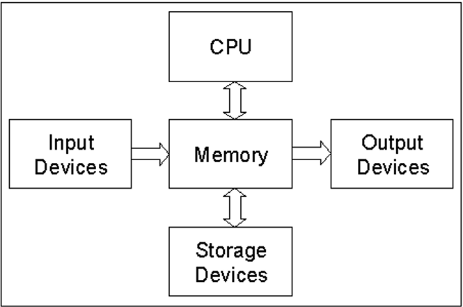
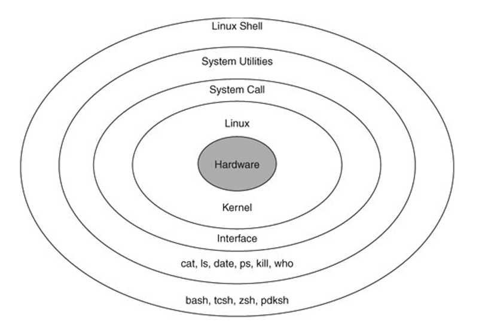

- Computer System
    - 일반적으로 4가지 요소로 구성
        - User (Human computer Interface ...)
        - Hardware (디지털 회로, 컴퓨터 구조...)
        - Software (운영체제, 데이터베이스, 시스템프로그래밍 ...)
        - Data(Infomation)

- Hardware System 
    - (화살표 중요)

        

    - CPU(인텔, AMD)
    - Memory
    - Storage Device (HDD, SSD) : 메모리로 옮기고 받는게 모두 가능
    - Input Devices, Output Devices

- Software
    - System Software (시스템 소프트웨어)
        - OS (윈도우, 유닉스, 리눅스 ...)
        - DB
        - 컴파일러
    - Application Software (응용 소프트웨어)    
    - shell 밖은 User
        
        

        - Linux OS에서 User는 직접 Hardware에 System call을 통해 접근할 수 있을까? X
            - System Utilities와 커널의 도움을 받아야한다
        - Git SCM 설치 -> HD를 제외한 모든 것이 설치된다 (리눅스의 MINGW)
        - System call : C언어로 짜인 함수
            - 리눅스 시스템에 C컴파일러가 항상 들어있다.(사용자가 쓸 수 없도록 내부에 존재)
        - System Utilities : System call interface를 써서 만든 명령어들
        - Kernel

            

            - 운영체제가 SCI로 subsystem을 통해 하드웨어 구조를 조작
            - 즉, 커널이 하드웨어를 관리
            - I/O subsystem
                - Terminals, Socket, File system
                - device의 3종류 (character device drivers / Network device drivers / Block device drivers)   
                - Terminal

                    

                    - 현재는 선이 없는 형태(인터넷)
                    - Console :  terminal중 system에 직접 붙어있어서 특별한 제어가능
                    - 입출력 장치의 default 값 => C의 #include<stdio.h>
                    - 따라서, shell -> ... -> kernel -> terminal -> 입출력
                    - GUI vs CUI
                    - 터미널을 통해 ssh로 학교 서버의 sshd 서비스를 이용할 수 있다

                        - ex)
                        

                        - 학교에서 서버에 접근을 제공하는 서비스는 httpd, telnetd, sshd, git ... 매우 다양한데 그 중 sshd는 터미널로 접근 가능하다
                        - 암호를 치면 sshd가 식별 후 접속 가능 -> 접속 후 위치는 git.ajou.ac.kr
                        - sshd로 서비스로 들어갔으므로 가상 터미널을 받고 shell(오)을 실행시켜 줌 
                        - stdout: 연결된 git bash 화면(왼), stdin: 키보드
    
    - 컴퓨터에 Git bash 실행 -> 창 생성(virtual terminal) + shell실행
        - 의문점: 가상 터미널은 어디에 연결되어 있나?(사진의 선)
            - User의 컴퓨터 
        - 맥, 우분투에서 터미널을 열 때, shell이 실행됨 = 위노우에서 git-bash를 실행하면 터미널이 열리고 shell실행

- Process와 Processor   
    - CPU = Central Processing Unit = **Processor**
        - 실행하고자 하는 명령어는 Storage devices -> Memory로 옮겨져서 CPU가 처리 = **Process, job**
    - Processor가 Process를 처리    