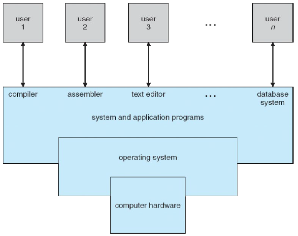
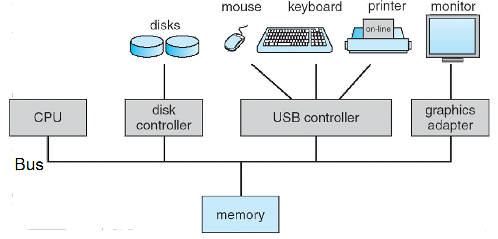
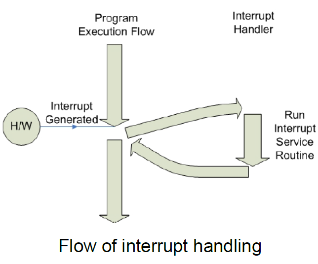
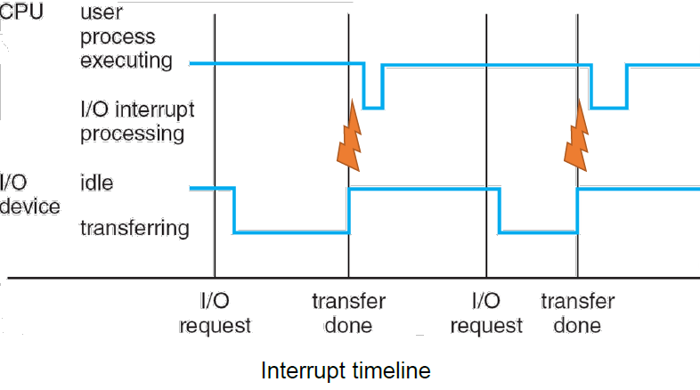
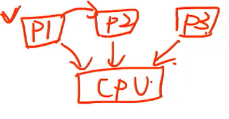
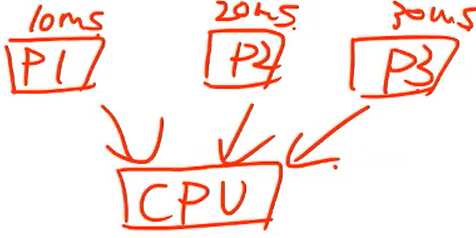

# Operating Systems

## Overview

- 컴퓨터 구조와 운영체제의 중간 내용을 배울 것이다.
- 지금까지 시스템프로그램인 SIC 구조의 어셈블러와 로더에 대해 배웠다.

## What is an Operating System?

컴퓨터 하드웨어와 어플리케이션들 사이의 매개체로써 수행하는 프로그램
- Software that converts hardware into a useful form for applications
- The one program so-called **kernel** running at all times on the computer

## What Operating Systems Do

- 유저와 어플리케이션 관점
     - OS가 편한하고 좋은 성능을 주는 인터페이스를 제공해줘야한다
     - 그 인터페이스를 통해 다음과 같은 하드웨어 디테일들을 숨기고 하드웨어 리소스를 사용할 수 있도록 해야한다
        - abstract view (**Abstraction**) 제공
            - Processors -> Processes, threads
            - Memory -> Virtual memory address spaces
            - Storage -> Volumes
            - I/O devices -> Files
            - Network -> Files
        - 위의 하드웨어(왼쪽)의 디테일한 컨셉을 숨기고 Abstraction 컨셉(오른쪽)을 이해하고 만들어서 사용할 수 있다면 쉽게사용할 수 있다.
- 시스템 관점
    - 리소스 사용을 위해 서로 경쟁하는 많은 응용 프로그램 및 사용자 처리
    - 컴퓨터 시스템의 다양한 자원을 관리
    - 컴퓨터의 오류 및 부적절한 사용을 방지하기 위해 프로그램 실행을 제어

## Operating System Services
- User Interface
    - CLI, GUI등에 따라 다름
- Program execution
    - Load a program into memory and run the program
    - 정상적으로 또는 비정상적으로 실행 종료(오류 표시)
- I/O operations
- File-system manipulation
    - 프로그램은 파일과 디렉토리를 생성, 삭제, 읽기, 쓰기가 필요합니다.
    - 검색, 파일 정보 나열, 권한 관리, …
- Communications
    - IPC
    - Processes may exchange information, on the same computer or between computers over a network
    - 공유 메모리를 통해 또는 메시지 전달을 통해(OS에 의해 이동된 패킷)
- Error detection
    - Constantly aware of possible errors
- Resource allocation
    - When multiple users or multiple jobs run concurrently, resources must be allocated to each of them
    - Many types of resources -CPU cycles, main memory, file storage, I/O devices
- Accounting
    - 어떤 사용자가 얼마나 많은 컴퓨터 리소스를 사용하는지 추적합니다.
- Protection and security
# How Computer Systems Work

- 위는 컴퓨터 시스템의 조직을 보여주는데, Bus path로 연결이 되어있다.
- 이를 통해 CPU와 다른 controller들이 memory를 읽거나 새로운 data를 저장하기위해 bus path를 이용하게 된다.
- 문제는 bus path에 한번에 하나의 component만 이동하므로 이를 이용하는데 경쟁이 생겨 문제가 된다.
- 기본적으로 device controller들은 I/O device들과 연결이 되어있다.
- device controller들은 local buffer를 가지고 있기때문에 임시적으로 외부 데이터를 저장할 수 있다.
    - Controller와 I/O device사이에서의 데이터 이동을 **I/O operation**이라고 불린다
- CPU는 각 controller에 있는 데이터를 메인메모리로 옮긴다. 
    - I/O operation이 끝났을 때, 비로소 옮길 수 있다.

- 그렇다면 CPU 입장에서 device controller의 데이터가 언제 전달이 되는지 어떻게 알까? = I/O operation이 언제 완료가 되는지 어떻게 알까? 
    - polling(= programmed I/O)
        - CPU가 device controller에서 반복적으로 I/O operation이 끝났는지 물어보는 행위
        - I/O operation이 끝날 때까지, CPU는 아무 것도 못한는 상황이 발생
        - CPU cylcle을 매우 소모, 비효율적
- 이를 개선하는 방안 - **interrupt**
    - device controller가 만드는 전기적 신호이다.
    - I/O operation이 오래걸릴 경우 CPU는 다른 작업을 할 수 있고, 오랜 작업이 끝나면 비로소 interrupt를 CPU에게 날려서 memory에 옮기는 등 처리를 해줄 수 있다.

📌 실제로, CPU가 데이터를 옮기는 것이 아니라 CPU의 os이 처리를 해준다.
## Interrupt Handling Process

1. 시스템은 CPU의 현재 state(register)를 메인 메모리에 저장
2. 코드 플로우가 interrupt처리하기위한 서비스 루틴으로 점프
    - 서비스 루틴 : 컨트롤러에서 메인 메모리로 옮기는 등..
    - interrupt handler : interrupt 서비스 루틴
    - interrupt vector : interrupt들을 모아둔 배열같은 것
3. 불러온 시점으로 다시 return

## Operating System Operations

- I/O operation 실행하는 동안에도 computing opration을 수행할 수 있다.
- interrupt가 오면 현재의 상태를 멈추고 interrupt handler 처리
    - An operating system is interrupt driven
        - OS는 interrupt에 의해 동작하는 프로그램이다 .
        - Hardware interrupt : I/O device에 의해 발생
        - software interrupt : instruction에 의해 발생
            - ex) system call, error등 ...

## Multiprogramming
여러 프로그램을 동시에 돌리기위한 실행모델

- 3개의 프로세스와 cpu가 있는 가정
- OS는 이중 하나의 프로세스를 선택한다. 선택된 프로세스는 CPU를 점유하고 실행이 된다
- 그때, 동안 프로세스인 p2와 p3는 기다리고 있는다.
- 만약 실행중인 p1이 I/O operation이 필요할 경우가 생기면 running 상태에서 wait 상태로 바뀐다. 이때, OS는 다른 프로세스를 선택해서 그 프로세스가 CPU 점유해서 실행될 수 있도록 한다
- 이를 **job scheduling**이라고 한다
    - job = process

- 만약 p1이 wait 상태 없이 계속 running상태라면 사용자가 p3에 접근하기 위한 방법이 없다. 이는 interactive computing을 지원할 수 없다.

## Multitasking
- 그래서 새롭게 나타난 Multiprogramming의 확장판
- Time sharing으로도 불린다.

- OS가 각 프로세스에게 time slice를 할당 
    - time slice: 각 프로세스가 CPU를 사용할 수 있는 시간
- 각 프로세스의 시간이 그림처럼 할당되어있다면 사용자 관점에서 짧은 시간 내에 스위칭 발생. 사용자는 동시에 동작하는 현상처럼 느껴진다.
- interactive computing을 지원하는 executing model이다.
