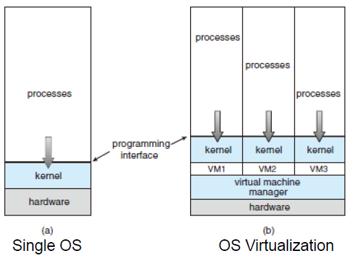
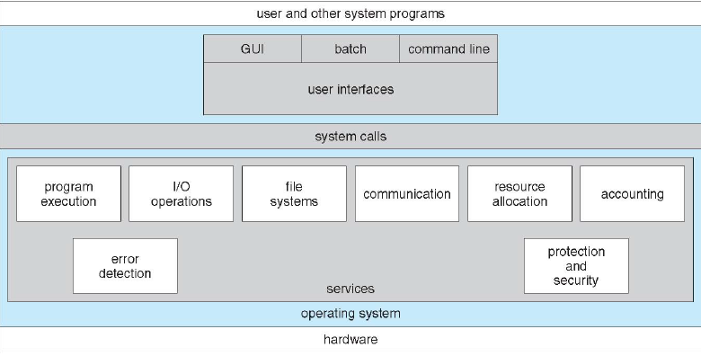
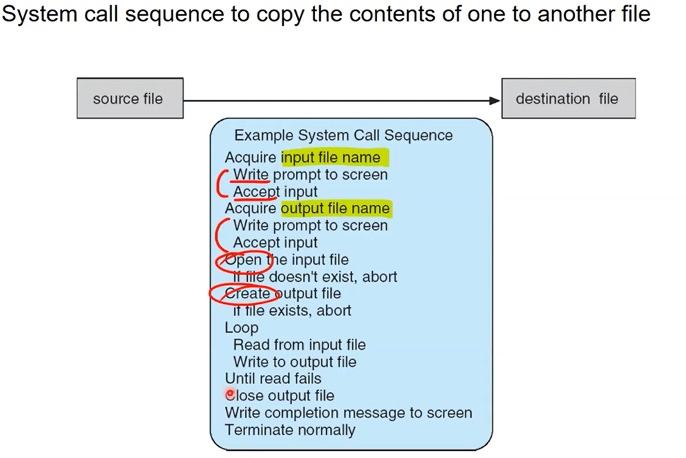
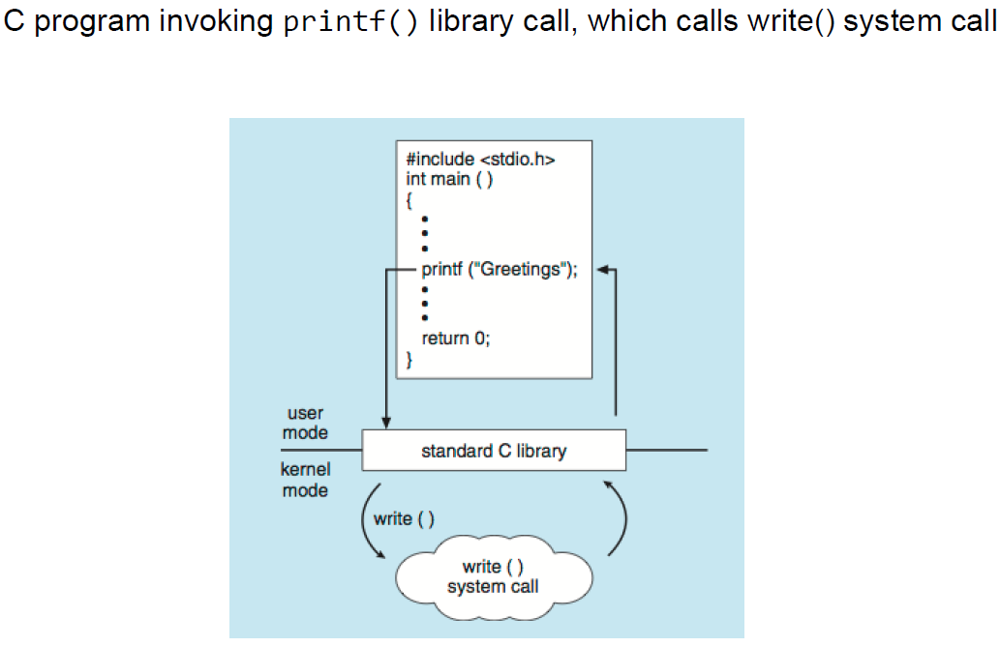

## Protecting the System

OS가 유저 어플리케이션(악성 앱)이 시스템에 나쁜짓을 하는 것을 어떻게 막을까?
- 만약 어플리케이션이 disk drive에 직접 접근해서 데이터를 조작한다면?
- 만약 어플리케이션이 interrupt handler를 재정의한다면?

이를 막기위한 방안으로 dual-mode operation을 수행한다.
- CPU가 user mode와 kernel mode로 구분하여 작동하는 것
    - 구분은 mode bit로
    - user mode에서 유저 어플리케이션만 실행할 수 있다.
    - kernel mode에서 OS만 실행할 수 있다. 
        - 모든 privileged instructions를 kernel mode에서 돌 수 있도록 강제화 
            - privileged instructions은 OS 서비스를 실행할 때 사용 됨.
            - ex) I/O device 조작
    - 만약 어플리케이션이 OS 서비스를 제공받으려고 할 때, privileged instructions이 실행되어야 하는데 OS을 통해 실행하는 것.

    

현대에는 CPU가 두개 이상의 실행 모드를 지원한다. (kernel mode, user mode, VMM mode)
- multi-mode operations은 OS Virtualize를 위해 존재한다.
- **virtual machine manager**(VMM)은 하드웨어 리소스를 관리하고 각 virtual machine이 침범할 수 없도록 막아주는 역할을 한다.

## Privileged Instructions

type
- Direct I/O access
- Accessing/manipulating system registers
    - Control registers
    - Interrupt service routine table (= interrupt vector)
- Memory state management
- HLT instruction in IA-32
kernel mode에서 실행할 수 있고, user mode에서 실행하면 **exception**이 발생한다.

## Interrupt vs Exception
- Exception(= Software interrupt)
    - 현재 CPU에서 실행되고 있는 instruction이 에러를 일으키거나 비허가된 데이터에 접근할 경우, OS 서비스 요청시 발생한다.
    - CPU실행에 맞게 동작한다. (동기화)
    - type
        - Trap
            - 애플리케이션에 의해 의도적으로 발생한 것.
            - OS관점에서 정상
        - fault
            - 애플리케이션에 의해 비의도적으로 발생한 것  
            - OS관점에서 비정상

- Interrupt(= Hardware interrupt)
    - CPU실행에 상관없이 I/O device가 언제든 interrupt를 발생시킬 수 있다. ( 비동기화)
    - ex) Timer
        - multitasking을 위해 사용되는 사례
        - 일정 시간 발생 뒤 interrupt 발생
 
현대 OS는 interrupt(exception)-driven이다.
- CPU모드가 user mode에서 kernel mode로 바뀌는 방법이 interrupt 또는 exception이 발생한 경우 밖에 없다.

## Systems Calls

OS에 의해 제공되는 서비스에 대한 프로그래밍 인터페이스
- 시스템 콜은 어플리케이션에 의해 직접 불리지 않고 high-level API 함수를 통해 호출된다.
- common APIS
    - Win32 API
        - for Windows variants
    - POSIX API
        - Unix, Linux, Mac OSX
    - Java API
        - for the Java virtual machine (JVM)

- 위 사진을 보면 알 수 있듯이, user application은 system call을 통해 OS를 사용할 수 있다.

### Types of System Calls
- Process control
- File management
- Device management
- Information maintenance
- Communications
- Protection

### System calls Example

실제 어플리케이션을 짜게 되면 여러 high-level API funciton을 호출하면서 짜게 되지만, 내부적으로 System call sequence(파란색)로 동작한다. 

어플리케이션이 직접 System call을 호출하는 경우는 드물다.

참고: POSIX API의 예만 해도 매우 많은데 이에 대한 설명을 **man** command로 알 수 있다.

### System Call Implementation
1. 각 시스템 콜은 unique number를 갖고 있다. (= **system call number**)
2. application이 시스템 콜 호출시 unique number도 OS에 같이 넘겨준다
3. OS는 system call table을 통해 unique number로 찾을 수 있다.
4. 반환값을 어플리케이션에 반환

프로그래머는 시스템 콜의 구현에 대해 신경 쓸 필요가 없다.

### System Call Parameter PAssing
시스템콜을 할 때, 매개변수도 OS에 넘겨줄 경우가 있는데 그러한 방법으로 3가지가 있다.

1. 간단한방법: general purposed register
    - 이 레지스터 수보다 파라미터가 많을 경우 아래의 2가지 방법 중 하나 사용
2. 메모리 블럭 방법
    - 유저 어플리케이션이 자신의 메모리 공간에 파라미터를 저장하고 메모리 블럭의 주소를 register에 저장. 시스템콜 이후 OS는 register를 통해 메모리 블럭의 주소를 알게되어 파라미터 접근 가능 
    - Linux와 Solaris에서 사용
3. stack area
    - 어플리케이션의 메모리 중 하나인 stack을 사용
    - 메모리 블럭 방법과 유사