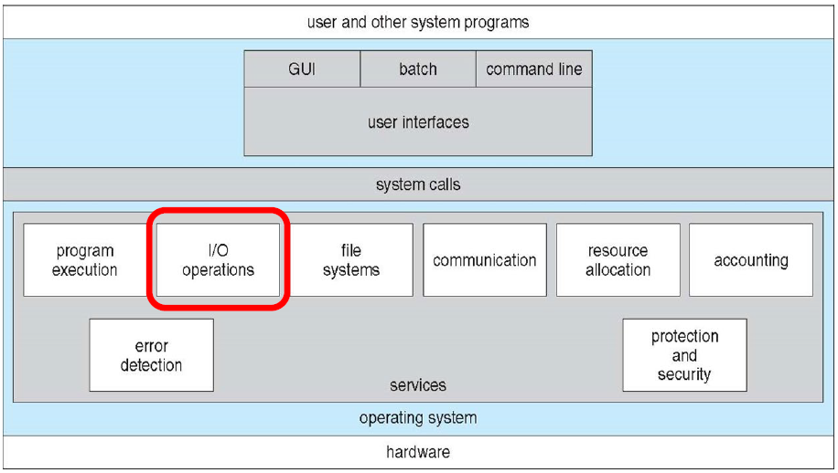
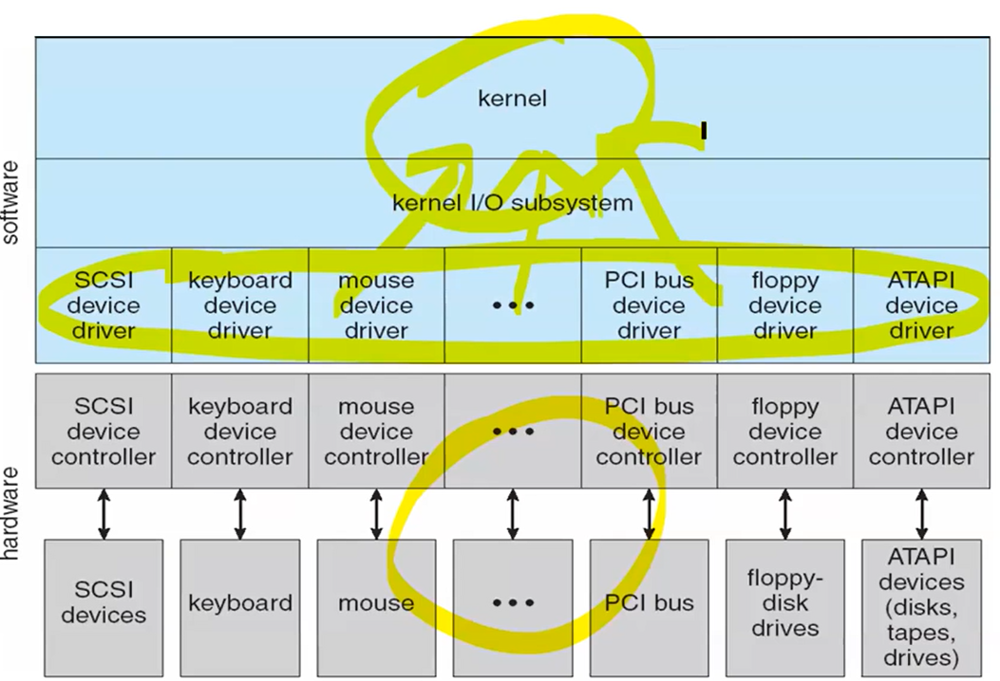

# I/O Systems and Operations

## Index
- An Overview of I/O Subsystem and Operations
- Stream Model
    - I/O functions
    - Standard streams
- Buffering
    - Block buffering vs. Line buffering vs. Unbuffered
- Pipes
- File I/O
    - File pointer
    - File Attributes
- Device I/O
    - Device Drivers
    - Block devices vs. Character devices vs. Network devices

# start

- The main job of a computer is I/O
- I/O를 다루기 위한 OS 역할
    1. I/O 디바이스를 제어
        - OS가 I/O 디바이스를 제어하기 위해 **디바이스 드라이버**를 사용
            - 디바이스 드라이버: 하드웨어 디바이스를 제어하기 위한 여러 인터페이스 function을 커널에게 제공

            

    2. I/O 오퍼레이션 관리
        - I/O Operation이 발생하면 기본적으로 데이터 전송이 발생
            - Most modern OS, including Unix/Linux, use the ***"stream model"*** to control I/O
                - Stream Model
                    - Stream: a flow of bytes

                        

                - 기본적으로 fopen과 fclose로 IO스트림을 만들 수 있고 종료시킬 수 있다.
                - fprintf와 fscanf로 단순, 데이터 전송이 아닌 byte 조작을 동시에 할 수 있다.
                - fread 함수는 fscanf함수와 달리 두번쩨 인자에 읽을 byte를 정해주고 세번째 인자에 얼마나 읽을 건지 알려준다. 또, 공백을 따로 처리해줘야한다
                    - ex) ``fread(text, 1, 15, fpt)``
                
## System I/O Functions

- open(), close(), read(), and write()
    - c 라이브러리에서 제공되는 function들이 아닌, OS가 제공하는 라이브러리 function.
    - 단순히 시스템콜을 호출하는 wrapper function이다. 즉, API함수지만 시스템 콜과 동일하게 작동한다
        - 시스템 콜은 어떤 OS에서 정의되느냐에 따라 조금씩 달라질 수 있다.
        - 시스템콜 레퍼함수들은 기본적으로 Buffering을 사용하지않고, f함수들은 버퍼링을 사용한다

## Standard Streams
- Standard in (stdin)
- Standard out (stdout)
- Standard error (stderr)

fscanf는 어떠한 스트림으로부터 바이트를 얻을 수 있고, scanf는 standard in stream으로부터만 데이터를 받을 수 있다. fprinf와 prinf도 마찬가지이다.

## Buffering

Sender가 Receiver에게 데이터를 보낼 때, 중간에 데이터가 임시적으로 저장되는 오퍼레이션을 버퍼링이라고한다

이를 시행하는 이유
1. 디바이스의 처리속도가 차이가 날 때,
2. 데이터가 전송되는 사이즈가 다를경우
3. copy semantics를 지키기위해