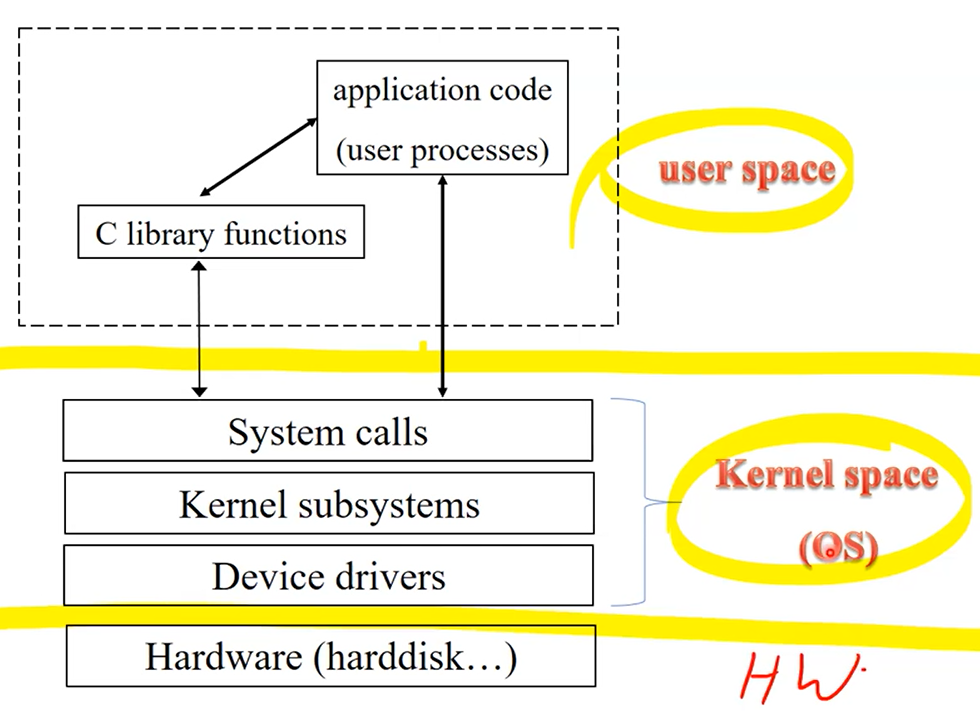

# OS Structures & Linux Overview

## Design and Implementation

- OS를 디자인하고 구현하는 방법에 대해 최고의 방법은 없다. 
하지만, 몇몇 aproach들은 성공하였다.

- 디자인 하기위해 "goal과 specifications(요구사항 명세서)"를 기반으로 해야함

- 원칙에 의거해서 디자인과 요구사항을 맞추면 되는데 원칙에는 정책과 메카니즘이 있다.
    - Policy
        - What should be done
    - Mechanism
        - How to do something
    - ex1) 타이머 인터럽트가 있을 때, 그것이 메커니즘이고 타이머 인터럽트를 언제 발생(어떤 값으로 설정)시킬 건지는 폴리시이다. policy는 시스템이 동작하는 환경에 따라 달라질 수 있음. -> 이때, 마다 메커니즘을 바꿔야하면 cost가 많이든다. 따라서, Policy로부터 분리하면 유연하게 설계할 수 있다. 이를 general mechanism이라고 부른다.

    - ex2) CPU scheduler : 시스템에서 프로세스를 바꾸는 행위 (프로세스간 스위칭)
        - Policy: 다음 프로세스를 무엇으로 할지, 스케줄링 알고리즘에 따라 퀀텀사이즈가 바뀐다.
            - Scheduling algorithm (FIFO, SJF, priority scheduling, …)  
            - Quantum size (= time slice)
        - Mechanism: 디스패처를 통해 컨텍스트 스위칭을 할 수 있음.
            - Dispatcher for low-level context switching
            - Measure job length
                - job length : 프로세스 실행시간
            - Priority queues
                - 실행하지 않는 (대기하는 ) 프로세스의 공간에서 행해지는 순서 -> 스케줄링 알고리즘에 따라 정해짐

    ### OS Implementation
    실제로, 언어를 섞어사용한다.
    - 하드웨어와 커뮤니케이션하는 커널에서는 어셈블리 언어를 사용하고 그외의 커널의 메인은 C로 구현된다

## Operating System Structure
- Simple structure : MS-DOS
    - 오래된 OS
    - 간단한 구조: 최소한의 공간으로 많은 functionality
        - 잘 분리되어있지 않아서 하나가 고장나면 주변이 고장날 가능성이 높다
    - 보완적으로 굉장히 취약하다
    - 여러 프로그램이 동시에 실행시킬 수 없다. 즉, 현재 실행중인 프로세스가 있다면 다른 프로세스가 만들어 질 수 없음. 다른 프로세스를 실행시키기 위해 현재 실행중인 프로세스를 중지해야한다.
- Layered Approach : Abstraction-based
    
    
    - 커널 기능에 따라 여러 레이어로 나누어져 있다. 가장 아래의 레이어는 하드웨어 관리하고 가장 상위 레이어는 사용자와 interact.
    - 각 레이어 사이에서는 **시스템 콜 인터페이스**가 있다. 리퀘스트를 보내기위해, 각 레이어를 지날때마다 트렌지션이 일어난다. (모드변경)
    - 한 레이어는 자신의 근처의 레이어에만 서비스를 요청 및 제공할 수 있다.
    - Modular
        - 확장성이 쉽다.
            - 한 레이어를 추가하고 싶으면 그 사이에 넣으면 되므로(해당 레이어를 건들지 않고),한 레이어를 추가하고 싶으면 그 사이에 넣으면 되므로(해당 레이어를 건들지 않고),
        - 유지하기 쉬움
            - 하나가 문제면 그것만 고치면 되므로
- Monolithic : UNIX

    
    - 유닉스 시스템은 fully layed가 아니다. 단지, 크게 user, kernel, HW layer로 나뉠 수 있는데 kernel에 모든 기능들이 있다. 특정 기능들이 하나의 레이어에 모여있어서 어떤 기능(function)들은 주변 기능(function)들을 호출할 수 있는데, 커널내부 기능들을 모두 사용할 수 있으니 레이어를 움직이지 않는 장점이 있음. 큰 바위로도 불림. 

    - 장점
        - 모드 변경이 적어(Layered Approach보다) 더 좋은 성능을 낼 수 있다. 
            - 인터페이스가 2개 밖에 없기 때문에 high speed performance를 보여준다.
        - Solaris, HP-UX, Linux, BSD 

    - 단점
        - 하나의 기능을 수정하려면 그것을 의존하고 있는 다른 기능들 또한 수정해야한다... (엔지니어링 코스트가 큼)
            - **상호 의존성**이 높아서 유지보수와 업그레드가 어렵다.
        - 안전하지 않음. 전체커널이 하나의 기능 에러때문에 망가질 수 있는 위험
- Microkernel : Mach

    
    - Monolithic의 단점들을 개선하기 위해 생겼다.
    - 커널에 있던 기능들이 유저레이어로 많이 올라와서 하나의 separating user process로 동작한다. 이런 시스템에서 user process가 다른 user process를 이용할고 싶을 때, request를 보내는데 메세지 패싱인 IPC메커니즘 통해 전달한다.(통신)
        - IPC (message passing 기능을 가짐) : 하나의 디바이스 안에서 어플리케이션이 통신하기 위해 존재
    - 커널 레이어에 OS의 핵심 기능만 있기 때문에 사이즈가 작아짐.
    - 장점
        - 확장성 (서비스를 추가하기 쉽다)
        - 새로운(다른) 하드웨어 아키텍처에 포팅하기 쉽다.
            - 하드웨어 아키텍처에 포팅하기위해서는 커널레이어를 수정해줘야하는데 마이크로커널은 크기가 작아서 수정이 쉽다.
            * 포팅(porting) : 하드웨어에 설치하는 행위. ex) 인텔에서 도는 OS를 ARM에서 돌게 해주는 것
    - 단점
        - IPC 오버해드가 존재
            - IPC 방식은 유저모드에서 리퀘스트 발생시 메모리 카피가 발생한다. os 서비스할때마다 발생하므로 전체 시스템의 성능을 낮출 수 있다.

## Monolithic vs MicroKernel
- Monolithic kernels
    - Pros: Simplicity and Performance benefits
    - Cons: Complexity and Less extensibility
- Microkernels
    - Pros: Easier for extension, More reliable (less code is running in kernel mode)
    - Cons: Performance overhead of user space to kernel space communication

### Modules
- 런타임에 로딩가능한 커널 모듈들을 제공한다 -> 컴퓨터 부팅할 때, 커널레이어에 핵심이 로딩됨. 나머지 커널 기능들은 secondary storage에 모듈 형태로 저장 됨. OS가 돌 때, 필요하면 가져다 쓸 수 있음

- Uses object-oriented approach

- 커널 레이어의 코드를 수정하지 않고 새로운 모듈을 추가함으로써 OS기능을 확장할 수 있다.

- 각 모듈은 정해진 인터페이스로 상호작용할 수 있다.

- Layered Approach와 차이점
    - Layered Approach : 자신의 위아래만 인터렉트 가능
    - Modules : 어떠한 모듈이든 인터렉트 가능(more flexible)

- MicroKernel과 차이점
    - 마이크로커널은 별도의 유저 프로세스로 작동해서 IPC오버헤드가 있지만, 모듈은 IPC 오버헤드가 없음

### Hybrid Systems
- 대부분의 OS들은 하나의 구조가 아닌 여러 구조의 이점들을 취하기위해 다자인 되어 있다.
    - ex) 리눅스는 모놀리딕(성능)인 동시에 모듈러디자인(확장성) 구조이다

## Linux Overview

### Why Linux?
- 대부분의 디바이스들은 리눅스 OS에 기반되어 있다.
- 리눅스 환경에서 어플리케이션을 개발하고 테스트하는 능력을 기를 수 있다.

### Why Linux Kernel?
- 리눅스 커널 아래에 있는 여러 메커니즘의 동작 과정을 이해하고 수정할 수 있는 능력을 배우기 위해
- ...

### The Linux System
- GNU Project로 개발된 툴을 사용
- **File System Hierarchy Standard** document

### 리눅스 디자인 원칙
- UNIX semantics를 고수한다
- 속도, 효율성, 표준
- Linux is designed to be compliant with the relevant **POSIX** documents
    - 표준 -> compatibility향상

### Components of the Linux System
- 리눅스 OS 구조는 크게 3가지
    - 커널
        - abstraction을 유지하는데 책임 : 하드웨어의 디테일을 숨기고 편하게 인터페이스를 제공하여 도와줌
    - 시스템 라이브러리
        - 어플리케이션을 사용하기 위한 API같은 것
    - 시스템 유틸리티
        - 시스템 프로그램이다.
        - 유저 레이어에서 써드파티가 만든 유저 어플리케이션이 돌 수 도 있지만, os에서 만든 시스템 어플리케이션이 돌 수도 있다.
        - 커널레이어를 돕기도 한다.
        - ex) 제어판

### Kernel Modules
- 커널 functionality를 위한 코드 블럭
    - 커널의 다른 파트와 상관없이 컴파일, 로드 등 독립적으로 실행.
- 커널 모듈은 독립적이기 때문에 GPL라이센스를 따르지 않고 영리활동을 할 수 있어서 사용된다.

### Linux System Architecture

- 유저 레이어에서 어플리케이션이 실행되면 라이브러리를 사용할 수 있고, 라이브러리를 통해 or 어플리케이션이 직접 시스템 콜을 호출한다.(os 서비스가 필요할 때)

- 결국, 리눅스 시스템에는 두가지 인터페이스가 존재한다.
    1. 시스템 콜 (유저와 커널 사이 인터페이스)
    2. 디바이스 드라이버 (커널과 하드웨어 사이)
        - 정확히 디바이스 컨트롤러와 통신한다