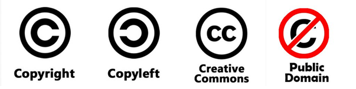

# IPR vs FOSS
소프트웨어가 지재권에 의해 내부를 자세히 볼 수도 없고 고칠 수도 없고 배포도 할수도 없는 즉, 사용을 자유롭게할 수 없는 돈을 받고 파는 물건이 되는 것에 대한 역작용에 의해 FOSS가 발생하였다.

- FOSS : Free Software or Open software

저작권과 오픈소스는 병립할 수 없는가? 결론부터 말하자면, 병행할 수 있다.

- 텐서플로우 예시를 보자👇    
https://github.com/tensorflow/tensorflow/blob/master/LICENSE
    - 이 오픈소스 프로그램을 어떤 라이센스로 주겠다라고 하는 것이 나와있다.
    - Copyright 2019 the tensorflow authors. + Apache License ver2.0
        - 텐서플로우 개발자들에게 저작권이 있음은 변하지 않고 소스를 공개(허여)할 것이다.
        - 단, 사용자는 Apache 라이센스에 따라 사용해야한다.

## COPYLEFT
저작권(copyright)에 반대되는 개념으로, 저작권에 기반을 둔 사용 제한이 아니라 저작권을 기반으로 한 정보의 공유를 위한 조치이다.

- 카피레프트를 사용하는 것은 라이선스의 사용 조건을 정리하는 것이다. 이러한 라이선스는 작품을 소유한 각 사람에게, 다음을 포함하여 저자와 똑같은 자유를 제공하는 것이다.
    1. 작품을 연구하고 사용하는 자유
    2. 작품을 다른 사람들과 같이 쓰고 복사하는 자유
    3. 작품을 수정하는 자유
    4. 수정된 작품, 곧 2차 저작물을 배포할 자유
        - 작품 : 결과물
- 이때, **자유는 공짜라는 의미가 아니다**
- 이러한 자유들은 2차 저작물이 같은 자유 조건 하에서의 배포를 보증하는 것은 아니다. 작품이 완전히 카피레프트가 되게 하려면, 라이선스는 2차 저작물의 저자가 이러한 작품을 동등한 라이선스 아래에서 배포할 수 있음을 보증해야 한다.

## FREE SOFTWARE
- 프로그램을 어떠한 목적을 위해서도 실행할 수 있는 자유 (자유 0).
- 프로그램의 작동 원리를 연구하고 이를 자신의 필요에 맞게 변경시킬 수 있는 자유 (자유 1).    
이러한 자유를 위해서는 소스 코드에 대한 접근이 선행되어야 합니다.
- 다른사람을 위해서 프로그램을 복제하고 배포할 수 있는 자유 (자유 2).
- 프로그램을 수정한 버전을 다른 사람에게 배포할 수 있는 자유 (자유 3).    
이를 통해 자신의 수정을 통해 만들어진 이익을 커뮤니티 전체에 줄 수 있습니다. 이를 위해서는 소스 코드에 대한 접근이 선행되어야 합니다

### 가정
1. 소프트웨어를 만든다. 둘 중하나를 선택한다. (free software -> 모두의 것 / proprietary software -> 내 것)
2. 내 것으로 선언할 경우, 상대방이 사용시 돈의 지불 유무를 정할 수 있음. 혹은 소스코드를 안보여 줄수도 있다.

## COPY 정리

- copyright
    - 내가 나의 저작물에 대해 베타적으로 권리를 갖는 것이다.
        - 저작권자의 허락없이 배포하거나 복제하거나 사용할 수 없다.
- copyleft
    - 마음대로 사용
    - 보통 로고를 사용하지 않는다.
    - 라이센스 모델이 명확하지 않기 때문에 creative commons를 사용
- creative commons(cc)
    - 어떤 것은 내가 선언한대로 permission을 줄 수 있다.
        - permission의 종류
            - BY(저작자 명시), SA(라이센스 변경x), ND(내작품을 그대로), NC(상업적으로 x)
            
- public domain
    - 그저 자유

## License(사용허가권)이란?
저작권을 가지고 있는 저작권자가 다양한 필요(사용, 복제, 배포 등)에 의해 자신의 **권리 중 일부분(또는 전체)을 일정내용의 조건으로 사용자가 사용할 수 있도록 권한을 부여한 것**.      
소프트웨어의 경우 소프트웨어를 사용하고자 하는 자에 대해 일정한 범위와 방법으로 프로그램을 사용할 수 있도록 인정해주는 것.    
**법률적인 효과가 있어 이를 위반할 때에는 법적 책임을 지게 된다.**
**소프트웨어에 대한 저작권은 여전히 원래의 권리자에게 남아있고 일부 사용에 대한 권리만을 부여하는 것**

- 어떤 회사가 나와 라이센스 문제가 생겼을 때, 법적 책임을 가지고 있는 상대방과 상의를 하면 된다. 하지만, 오픈소스로 무언가를 할때, 잘 알려진 템플릿처럼 일종의 표준 계약서 개념이 있으면 좋을 것 이다.
- 이렇게 오픈소스SW에서는 사람들에게 자신의 소프트웨어를 오픈하면서 제공하는 잘 알려진 소스코드 라이센스 모델이 있다.

### 1. BSD ( Berkeley Software Distribution ) / MIT 
- **수정된 Source Code 공개하지 않아도 되는 License**
- BSD 라이선스는 미국 정부의 재원으로 운영되는 경우가 많음 
- 공공의 이익을 위해 지정된 License 
- **다른 라이선스로 변경하여 상용으로 판매 가능**

### 2. Apache 2.0 
- Apache Software Foundation 에서 만든 License 
- **Apache 라는 상표권 침해하지 않아야 한다.**
- 특허 부분은 GPL 3.0 과 결합하여 GPL 3.0 으로 배포 가능 
- 수정 프로그램의 Source Code 공개 의무 없음     
- 예) apache, tomcat …  

### 3. GPL 2.0 License ( General Public License 2.0 )
- 1989년 1차,  1991년 2차 , 2007년 3차 버전 발표
- 영문판 GPL 2.0 문서 포함 배포 
- Source Code 수정시 수정 사실, 내용 및 그 날짜 등을 파일 안에 명시
- 수정하거나 새로운 Source Code 에 Link 시키는 경우 Source Code 를 GPL 로 공개
- Object Code 혹은 Running 모듈로 배포 시 Source Code 포함하거나 제공받을 방법 명시 
- 특허가 적용된 경우 GPL 조건에 충족한 사용자의 경우 특허료 받을 수 없음. 특허료를  만약 받고자 하다면 GPL 로 배포할 수 없음.

### 4. GPL 3.0 
- 2007년 6월 29일 공표 
- GPL 2.0 과 유사 
- 설치에 필요한 모든 정보 제공 : 설치 방법, 절차, 인증 키 등등
- DRM 과 관련해서는 각국의 법률에 의해 보호되는 이익을 포기해야 함
- 특허를 개선하여 배포한 경우 자신이 기여한 부분에 대해 비차별적이고 무료라는 라이선스 제공 필수
- 특허와 관련 되서 특허 소송을 제기한 경우 그 날부터 해당 제품의 GPL 은 종료 ( ? )
- Apache License 2.0 및 Affero GPL 3.0 과 **양립 가능** 

### 5. LGPL 2.1 License ( Lesser GPL , formerly Library GLP) 
- 공개 SW 의 활용을 장려하기 위한 전략적 차원의 License 정책  
- 상용 SW 를 만들고 있는 경우 강력한 GPL 은 사용하기 꺼린다.
- 추가 작성된 원 Source code 공개 없이 사용된 GPL Source Code 만 공개하도록 제한
- LPGL 적용을 명시해 배포 
- LGPL 라이브러리 수정한 경우 수정한 라이브러리의 Source code 공개
- LPGL 라이브러이에 응용 프로그램 Link 한 경우 응용 프로그램은 비공개 가능. 다만, Static Link 로 LGPL 라이브러리 사용시 Object Code 공개
- 특허는 GPL 과 동일   
- 예) WildFly 등    

## Above License summary

- **Reciprocal** : 호혜 (내가 너한테 해줬으니 너도 나한테 해줘)
    - ex) 나도 오픈했으니 너도 오픈해
    - 특허 관련해서 특허를 쓸 수 있는 것, 쓸 수 없는 것, 특허가 무효화되는 것이 달라짐
- Permissive : 맘대로 써라(단, 제약이 있을 수도 있음)
## License 주요 의무사항

- 모든 License의 공통점
    - 복제, 배포, 수정 권한 허용
    - 저작권 고지 사항 유지
    - 보증의 부인
    - 책임의 제한
        - 사용자가 모든 책임 전가
- 주의
    - 배포시 소스코드 제공의무 (**Reciprocal**)와 범위
        - 내가 GPL 라이선스가 있는 코드를 사용하면 내 것도 **전체**를 공개해야한다.
        - LGPL 라이선스가 있는 코드를 사용하면 그 것에 **관련된** 소스코드만 공개해야한다.
    - GPL, LGPL은 특허 라이선스의 허용 x

# Ref

- https://www.slideshare.net/chungkong/what-is-the-diffenrence-between-copyright-trademarks-and-registered-trademarks 

- 공개SW역량프라자. 상용 SW 개발 관점에서의 OSS License Compliance 
