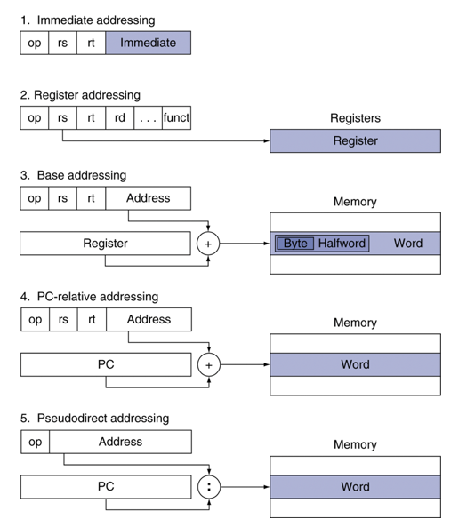
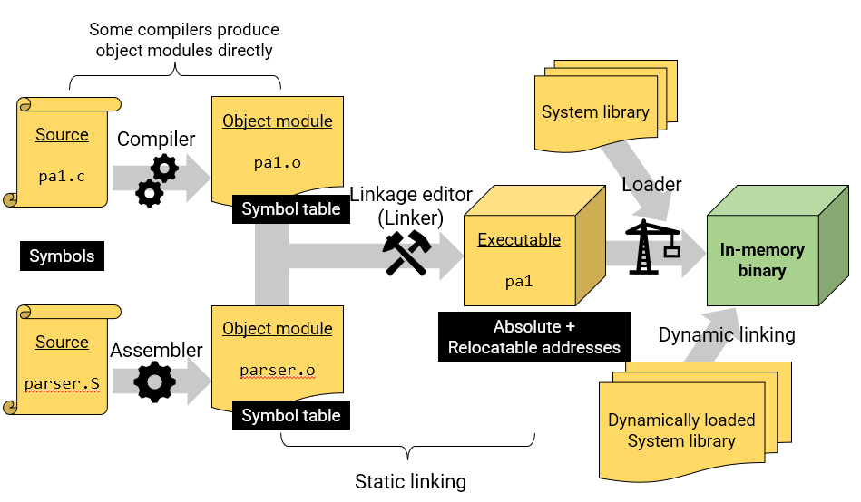

# Addressing

## Index

- addressing
    - Immediate addressing
    - Register addressing
    - Base addressing
    - PC-relative addressing
    - Psedodirect addressing

- Compiler, object modules, linking

## Start



Branch Addressing

- 분기(branch) instructions에 사용되는
    - opcode, 2registers, target address

- 대부분의 분기 대상(branch target, 분기 조건에 따라 이동하게 되는 곳)은 branch(지금 루틴) 근처에 존재한다.
    - 앞으로 혹은 뒤로

- PC-relative addressing (PC가 가리키는 주소를 활용)
    - target address = PC(Program counter) + offset(위에서 address)*4
    - MIPS에서, PC는 어떤 루틴에 들어가면, 다음에 실행할 명령의 주소값을 가리키게 되어있음. 즉, 이미 이번 분기에 진입할 때 4만큼 증가했었음. 그러므로 타겟 주소를 계산할 때 고려해야 함.

Jump Addressing
- 점프(j와 jal) 대상은 어디든 가능함. (**branch 타겟과 달리 멀리로도 가는 편**)
- Pseudo-direct jump addressing
    - 현재 PC의 상위 4비트와 address에 4를 곱한(left shift 2번) 28비트를 합쳐서 32비트로

Character Sets
- byte-encoded(1byte=8bit) character sets
    - ASCII: 128 characters (2^7)
    - Latin-1: 256 characters (2^8)
- Unicode: 32-bit character set👍
    - Java, C++ 등에서 쓰임
    - UTF-8, UTF-16: variable-length encodings
    - 대부분의 국가 언어 문자와 기호를 표현 가능

Byte/Halfword Operations

- 1Byte(8bits)/2Bytes(16bits)
- bitwise operation으로 1비트씩 옮길 수도 있지만, byte/halfword 단위로도 데이터 이동이 가능하다.
- MIPS byte/halfword load/store (String 처리가 일반적인 경우이다)        
    ```lb　rt, "offset"(rs)　　　lh　rt, "offset"(rs)```
    - 메모리 주소로부터 부호있는 값의 하위 8/16비트들을 불러와, 32비트로 늘려서(LSB의 값과 같은 비트가 복제되어 왼편에 나열). 레지스터(rt)에 불러옴.    
    
    ```lbu　rt, "offset"(rs)　　　lhu　rt, "offset"(rs)```
    - 메모리 주소로부터 부호없는 값의 하위 8/16비트들을 불러와, 32비트로 늘려서(LSB 왼편은 모두 0으로 나열). 레지스터(rt)에 불러옴.

    ```sb　rt, "offset"(rs)　　　sh　rt, "offset"(rs)```

    - rt의 값 중 하위 8/16비트의 값을 메모리 주소가 가리키는 곳에 저장

String 
- A sequence of (human-readable) bytes

32-bit Constants
- 대부분 상수는 작아서 16-bit immediate면 충분하다
- 가끔 32비트 상수의 경우, 16비트 상수를 rt의 왼쪽 16비트에 복사 + rt의 오른쪽 16비트를 0으로 지우기
    - ```lhi　rt, "constant"```

Making a Program
- 프로그램에서 주소가 결정되는 방법
    
    

- Producing an Object Module
    - Assembler (or compiler) translates program into machine instructions
    - information for building a complete program from the pieces
        - Header: obj module의 content 설명
        - **Text segment**: 번역된 instructions
        - **Static data segment**: 프로그램의 life로부터 할당된 데이터
        - Relocation info: 로드된 프로그램의 절대 위치에 의존하는 콘텐츠의 경우
        - **symbol table**: Global definitions and external references
        - Debug info: 소스 코드와 연결하기 위해

- Linking Object Modules
    - Produce an executable image
        - Merge segments
        - Resolve labels (determine their addresses)
        - Path location-dependent and external references
    - Could leave location dependencies for fixing by a relocation loader
        - Program can be loaded into absolute location in virtual memory space
- Loading a Program
    - Load program image from file on disk into memory 
        - Read header to determine segment sizes
        - Create the address space 
        - Copy text and initialized data into memory,(or set page table entries so they can be faulted in) 
        - Setup arguments on stack 
        - Initialize registers (including $sp, $fp, $gp) 
        - Jump to startup routine 
            - Copy arguments to $a0, ... and calls main
            - When main returns, do exit syscall
- Dynamic Linking
    - Only link/load library procedure when it is called
        - DLL = Dynamic Linking Library
        - 모든 (전이적으로) 참조된 라이브러리의 정적 링크로 인한 이미지 팽창 방지
        - 재배치 가능한 procedure 코드 필요
        - 새 라이브러리 버전을 자동으로 선택