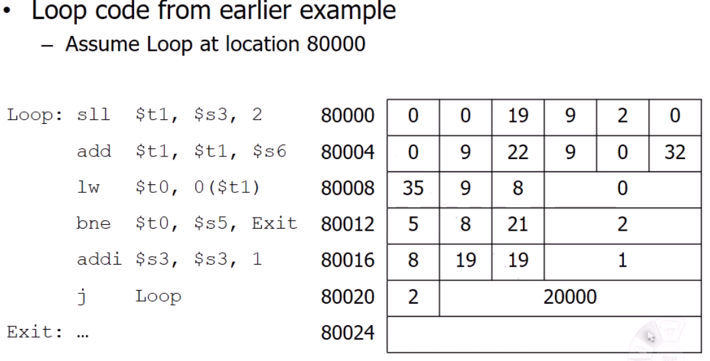
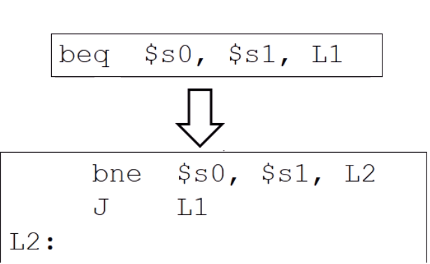
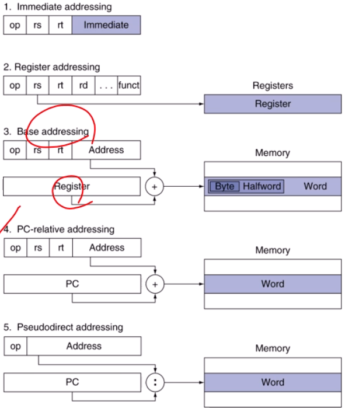

# Communicating with people (handling characters)

## character Data
컴퓨터는 문자열을 어떻게 다룰까?

- Byte-encoded character sets
    - 아스키코드(128개)를 숫자에 매핑시켜 표현한다

- Unicode: 32bit character set
    - 한글 등 영어를 제외한 언어, 기호를 표현할 수 있다

# Addressing for 32-bit Immediates and Addresses

대부분의 상수(constants)는 작다
- 16비트 immediate로 충분하다

하지만, 가끔은 32비트 상수를 표현해야할 경우가 발생한다 (32 bit architecture라서)
- 하나의 instruction은 그자체가 32비트인데 I format만 봐도 16비트로 데이터를 표현한다.. 이는 2의 16승에 해당하는 데이터 밖에 표현을 못함을 의미한다
- 이럴 경우 어떻게 처리해야할까? (in MIPS)
- 32비트 데이터를 상위 16와 하위16비트로 쪼개서 레지스터에 차례로 저장해서 표현한다
    - lui : 상위 16비트에 저장
    - ori : 하위 16비트에 저장

- constants말고 address는?

## Branch Addressing

- 대부분 브랜치 target은 가까이에 있어서 2의 16승으로 충분히 표현되기(가리키기) 때문에 I format은 주소를 위해 16bits를 사용
- 하지만 멀리 점프를 하고 싶을 때, 문제가 발생
- 해결: 현재 위치(PC)를 기준으로 얼만큼 떨어져있는지 x 4바이트 계산하면 위치를 알수 있다
- PC는 다음번 instruction을 준비하기 위해 4를 증가시킴

## Jump Addressing
- 26비트는 앞의 16비트보다 많이 표현될 수 있지만 32비트는 모두 표현하지 못한다.
- 해결: 움직여야할 address는 instruction단위인 4바이트이기때문에 offset으로 표현하면 된다.
- 28까지 offset으로 해결가능하고 나머지 4비트는 PC로 가져와서 32비트 표현

## Target Addressing Example
 

- 80012주소의 address 2는 현재 PC값(80016)에 2(offset)*4를 더하여 Label을 알 수 있따는 의미
- 80020주소의 address *4만큼한 곳으로 이동해야한다

- 정리: 총 32비트를 가지고 있을 수 없기 때문에 축약해서 표현하는 방법이 필요하다. 특히, I format의 경우 16비트밖에 없기때문에 현재 내가 있는 PC기준으로 얼마만큼 떨어져 있는지 인덱싱해서 의미를 파악할 수 있다. J format의 경우 26비트밖에 없기때문에 32비트까지 6비트가 부족하다. offset개념으로 2를 늘릴 수 있고 이 값과 나머지 PC에서 가져온 상위 4비트로 접근(Jump)해야할 메모리 address를 가져올 수 있다.

## Branch Far Away
- Branch destination이 너무 멀어서 16비트안에 안들어올 때는 어셈블러가 똑같은 의미를 다르게 해석하는 방식으로 해결

    

    - L1 Label로 점프를 해야하는데 L1 주소가 앞의 방법으로 못 표현할 범위에 있을 수도 있다. 이럴 때, 위 사진처럼 바꾸어 해결할 있다.

## Addressing Mode Summary
