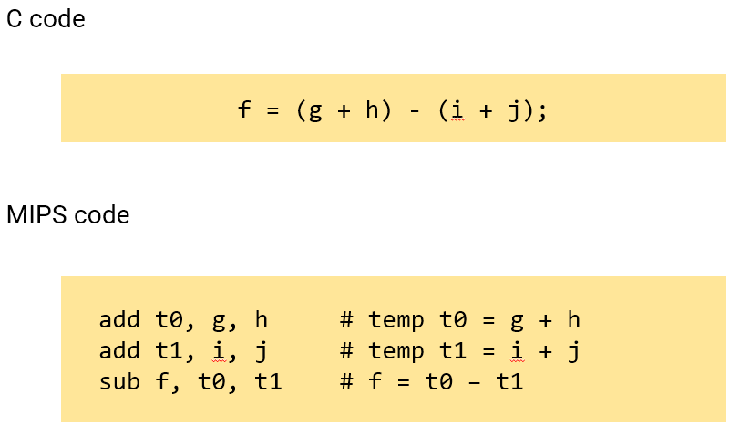
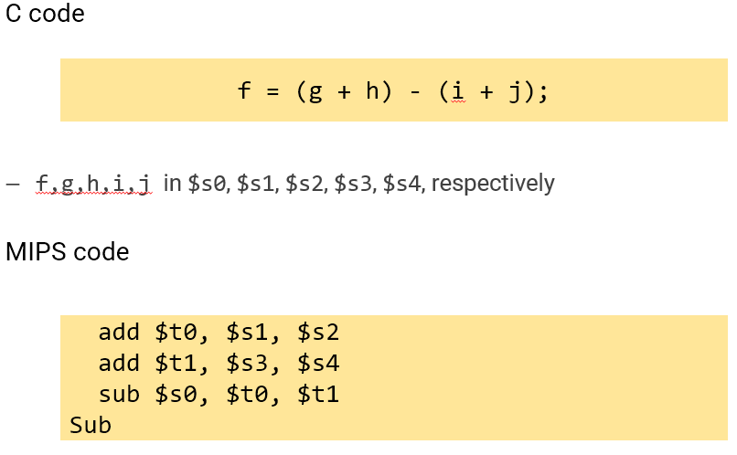
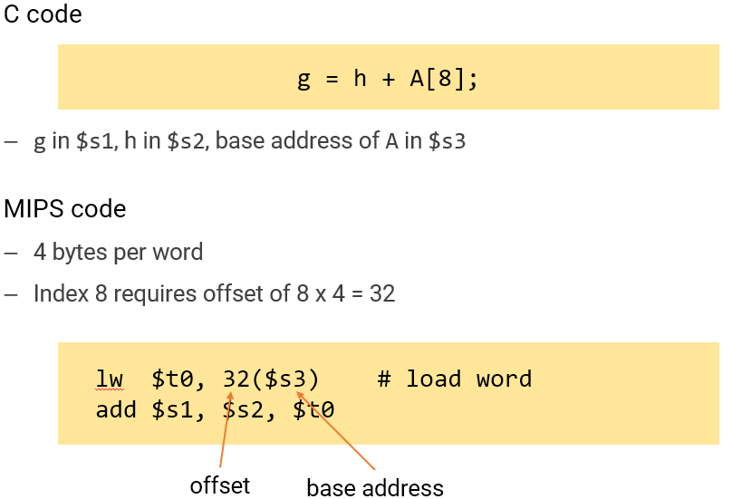
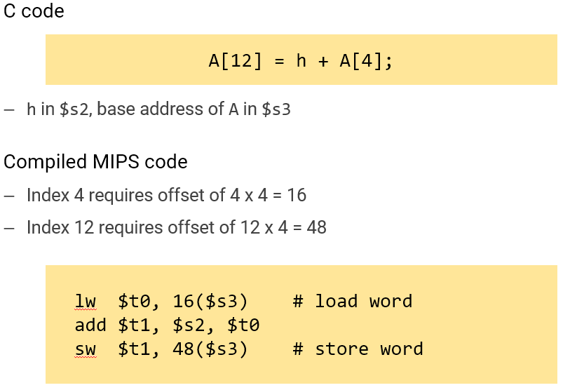

# Arithmetic Operations

## index

- Instruction set
    - The list of instructions of a computer
- Different computers, different instruction set
    - Different performance, different efficiency, …
- MIPS instruction set
    - Arithmetic: add $t0, $s1, $s2; sub $t1, $s2, $s3;
    - Operands: registers($t1) and memory (12($s3))
    - Data should be loaded into registers to perform operations
        - lw, sw

## start

Architecture
- “the attributes of a system as seen by the programmer, the conceptual structure and functional behavior”
- 소프트웨어와 하드웨어사이를 보이게 하는 interface이다. 여기서 얘기하는 interface는 instruction이다. Instruction을 통해서 소프트웨어가 하드웨어를 작동시키는 원리다. 정리하면 컴퓨터 아키텍쳐는 하드웨어와 소프트웨어의 abstracted interface이다

- 컴퓨터 아키텍쳐는 ISA(Instruction set architecture)를 정의한다.
    - Instruction set
    - Operand types
    - Data types (integers, floating points, …)
    - Memory addressing modes, …

Instruction Set
- Many modern computers also have simple instruction sets
    - RISC (Reduced Instruction Set Computer)

- Different computers have different instruction sets
    - But with many aspects in common

- MIPS Instructions
    - 32-bit binary numbers from human’s perspective Ex) 0x02324020

    - This form is hard to express / interpret what we want

- MIPS Assembly
    - human-readable expressions of MIPS instructions Ex) add $t0, $s1, $s2

    - MIPS assembly code is equivalent to MIPS instructions

    - C compiler actually converts **C code** into **MIPS assembly**, and then the assembly code is converted to **MIPS instructions** by MIPS assembler

Arithmetic Operations
- Add and subtract, three operands
    - Ex) add a, b, c
        - a = b + c
    - Ex) sub x, y, z
        - x = y - z

- Example
    
    

Register Operands
- Arithmetic instructions use register operands
    - i.e., cannot directly use values in memory
    - MIPS has a 32 x 32-bit registers
        - Numbered 0 to 31
        - 32-bit data called a ”word”

- Example

    

Memory Operands
- Main memory used for composite data
    - **Arrays**, structures, dynamic data
- To apply arithmetic operations
    - Load values from memory into registers (lw)
    - Store result from register to memory (sw)

- Memory is byte addressed
- Words are aligned in memory
    - Address must be a multiple of 4
- MIPS is **Big Endian**
    - Most-significant byte at least address of a word
- Example

    

    

Register vs Memory

- Registers are faster to access than memory
- Operation on memory data requires to be loaded / stored
    - More instructions to be executed
- Compiler must use registers for variables as much as possible
    - Only **spill** to memory for less frequently used variables
    - **Register optimization** is important

# Ref
- https://readyfortest.tistory.com/44
- https://hellchanggongdoll.tistory.com/82?category=887753