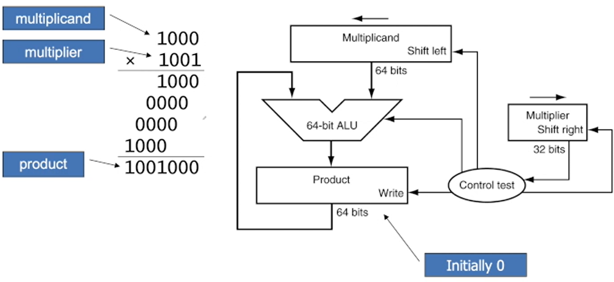
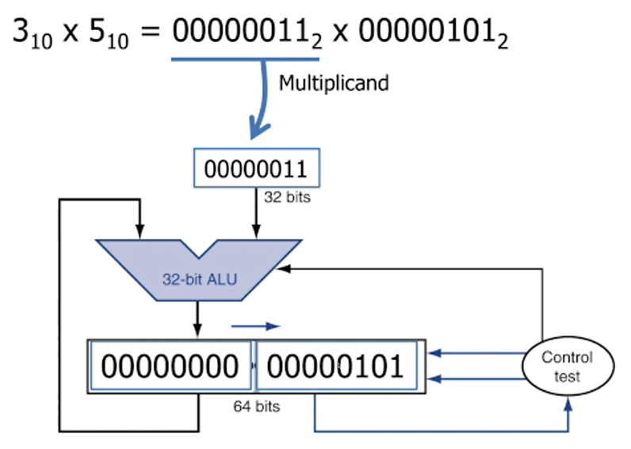
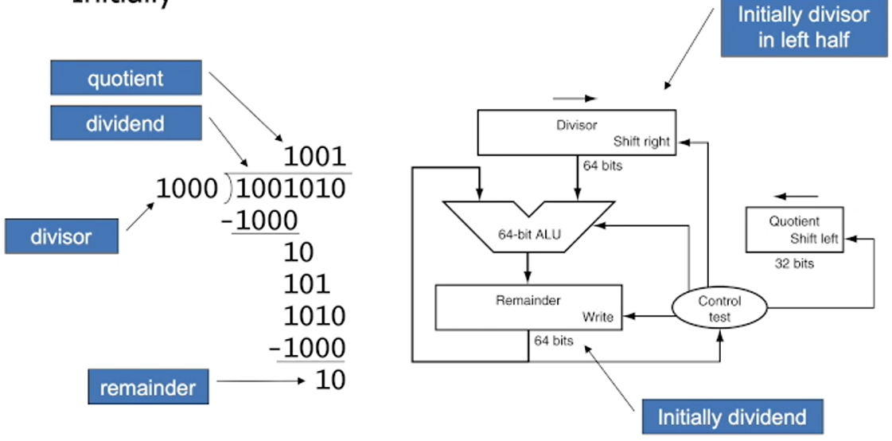
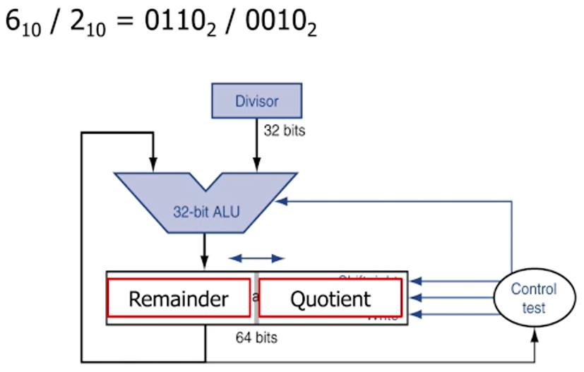

# Arithmetic for Computers


## index
- 컴퓨터에서 연산장치(특히, 곰셈과 나누기)를 어떻게 처리하는지 알아보자
- 컴퓨터에서 floating point 처리를 어떻게하는지 알아보자

1. Operations on integers
    - Addition and subtraction
    - Multiplication and division
    - Dealing with overflow

2. Floating-point real numbers
    - Representation and opertaions

### Integer Addition
- 만약 결과가 overflow라면
    - 서로 부호가 다른 경우 overflow가 발생하지 않는다.
    - 부호가 같은 경우 
        - 둘 다 양수인경우, sign bit가 1이라면 값이 넘어가서 음수가 된 것.
        - 둘 다 음수인경우, sign bit가 0이라면 값이 넘어가서 양수가 된 것.

- overlow가 발생했다?
    - 정해진 비트로 의도했던 수을 표현하지 못 한것
        - ex) 4비트는 최대 15까지 표현할 수 있고  15를 넘어서 표현할 수 없음
        - 그 이상의 값은 표현 못 함.

### Integer Subtraction
- 만약 결과가 overflow라면
    - 서로 부호가 같은 경우 overflow가 발생하지 않는다.

### Multiplication
- 긴 연산이 필요(3단계)



### Optimized Multiplier



- 적은 양의 하드웨어로 빠른 성능
- 물론 앞의 3단계를 지금 1단계로 바꿔주긴했어도 연산이 많음

### Faster Multiplier
- 병렬적으로 처리
- 많은 비용이 들지만, 성능을 빠르게 함 

### MIPS Multiplication
- 곱셈의 결과로 두 32비트 레지스터
    - HI
        - 상위 32 비트
    - LO
        - 하위 32 비트

- Instruction
    - ```mul rs, rt / multu rs, rt```
        - HI/LO로 64비트 결과
    - ```mfhi rd / mflo rd```
    - ```mul rd, rs, rt```
        - 곱셈의 결과가 32비트로 표현할 수 있다면 mul을 사용해도 된다.

### Division



### Optimized Divider



- Optimized Multiplier에서 본 것과 비슷하다

### Faster Division
- 병렬적으로 할 수 없다.
- 따라서, 컴퓨터 연산에서 가장 오래걸리는 것이 나눗셈이다.

### MIPS Division
- 나눗셈의 결과로 두 레지스터
    - HI
        - 32-bit remainder
    - LO
        - 32-bit quotient

- Instruction
    - ```div rs, rt / divu rs, rt```