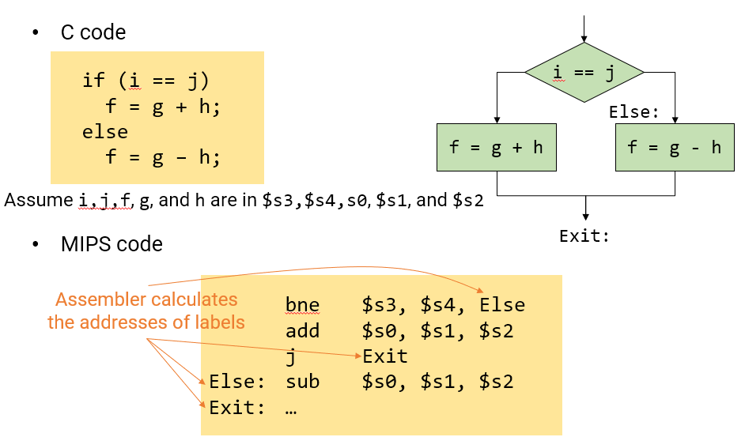
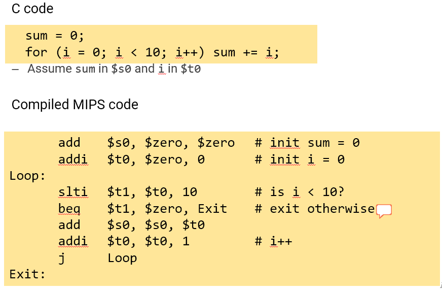
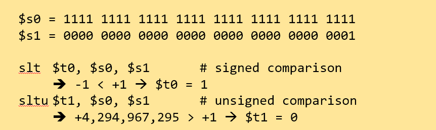

# MIPS ISA - Branches

Conditional Operations 
- 만약 조건(condition)이 true라면, 표시(label)된 instruction으로 향하게 하는 분기(branch)
    - 그렇지 않으면(false), 그대로 진행(continue sequentially)
        ```
            Beq rs, rt, L1
        ```    
        - If(rs==rt) jump to L1. L1은 address of target instruction이다.
        - 만약 rs==rt 라면, L1이라고 표시된 instruction으로 이동

        ```
            Bne rs, rt, L1
        ```
        - If(rs!=rt) jump to L1
        - 만약 rs!=rt 라면, L1이라고 표시된 instruction으로 이동
        ```
        J L1
        ```
        - 모든 조건 무시하고 일단 L1 instruction으로 점프한다.

Compiling If Statements
- if 구문 컴파일
    
    

Compiling Loop Statements
- 반복 구문 컴파일
- EX1) C code:

    - while (save[i] == k) i += 1;

        - i는 $s3에, k는 $s5에, 배열 save의 시작 주소는 $s6에.

- 컴파일된 MIPS code:
    ```
    - 　Loop: sll　$t1, $s3, 2　    # i << 2 , $t1 = i * 4 

        　　　add　$t1, $t1, $s6　  # $t1 = save + i * 4 = &save[i]

        　　　lw　　$t0, 0($t1)     # $t0 = *(&save[i]) = save[i]

        　　　bne　$t0, $s5, Exit   # save[i] == k

        　　　addi　$s3, $s3, 1     # i = i + 1

        　　　j　　　Loop

        Exit: ...
    ```
    1. 처음 주어질 i index만큼의 주소(4byte)를 위해 2^2=4를 곱해둠
    2. offset(위에서 구해둔 i*4)에 시작 주소 더하면 save[i]의 주소
    3. 그리고 lw 를 이용하여 $t0 에 save[i] 를 불러온다.
    4. 그 후, 조건 분기를 통해서 while 문의 조건을 확인하고, j 를 통해 반복문을 구현한다.
- EX2)

    

Basic Blocks

Code block은 sequence of instruction이다. 이는 두가지 특징을 가지고 있는데
1. No embedded branches. 앞서 말한 조건문 branch instruction들이 포함되지 않는다. 그래서 중간에 다른 Exit로 가는 것이 안된다.

2. No branch targets. 중간에 들어오는 것도 안된다.

정리하자면 code block에서 시작이 되면 반드시 끝까지 가야한다.

왜 중요하냐면 a compiler identifies basic blocks for **optimization**. 이 뜻은 컴파일러는 이 basic block을 optimization할때의 하나의 유닛으로 보기 때문이다.

An advanced processor can be accelerate execution of basic blocks. 어차피 위의 특성 때문에 쉽게 주어진 코드를 보고 쉽게 결과를 예측할 수 있기에 basic block의 실행을 가속화 시킬 수 있다.

 

More Conditional Operation

어떠한 조건들을 해당할 때 결과값을 1 또는 0을 내는 operation을 볼 것이다. 1이면 참, 0이면 거짓이다.
```
slt rd, rs, rt          #if(rs < rt) rd=1, else rd=0
```
set은 값을 1으로하고 clear는 0으로 바꾼다.
```
slti rt, rs, constant   #if(rs < constant) rt=1; else rt=0
```
Beq, bne이와 결합하여 이런식으로 사용하기도 한다.
```
slt $t0, $s1, $s2  #if($s1 < $s2)

bne $t0, $zero, L  #branch to L
```

- Branch Instruction Design

    - 분기 명령 설계
    - 왜 blt(branch less than), bge(branch greater or equal), ...은 없는가?
    - 하드웨어 입장에서 ＜, ≥의 연산은 ＝, ≠ 보다 느리다.(복잡하다)
        - 모든 분기를 지원하면, 한 instruction마다 기존보다 더 많은 일을 수행하고 되고, 클럭 속도가 느려진다.
        - 모든 instruction 전체가 불이익을 받는다.(느려진 클럭 속도로)
        - beq와 bne가 더 일반적인 경우로 잦게 쓰인다.
        - 좋은 설계를 위한 타협이다.

    - 요약 : 왜 blt, bge이런 operation처럼 더 간편한 operation이 없을까? 그냥 대소비교 >, <, <=, >=는 같다, 다르다와는 조금 더 복잡하다. 그래서 branch instruction이 조금 복잡하다. 그래서 대소비교 operation은 clock cycle을 조금 느리게 한다. 왜냐하면 <=, >=와 같이 두개의 복잡한 operation를 같은 clock에 동작하게 하여야 한다. Instruction set은 가장 느린 clock speed를 참고하게 되는데 이렇게 되면 느려진 clock speed 때문에 다른 모든 instruction조차 느려지게 된다.

- Signed vs Unsigned

    - Signed comparison: slt, slti

    - Unsigned comparision: sltu, sltui

    - EX)

        

# Ref
- https://readyfortest.tistory.com/45