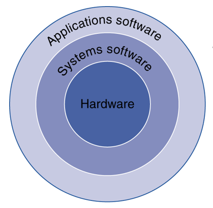
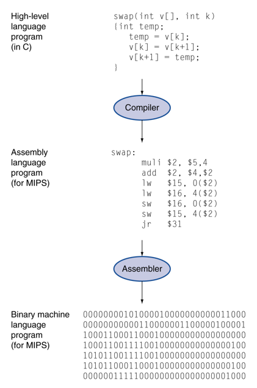

# Computer Components

- Components of a Computer
    - Processor (Datapath, Control), Memory, Input, and Output
        - Memory
            - Dynamic RAM (DRAM)
                - An array of small capacitors called cells
                - Should be refreshed periodically (lost data otherwise)
                - Simple, easy to manufacture, easy to increase density
                - Used for main memory
            - Static RAM (SRAM)
                - No need to refresh
                - Fast to read and write
                - Small and expensive
                - Usually used for on-chip cache

        - Secondary Storage
            - Volatile main memory
                - Loses instructions and data when power off
            - Non-volatile secondary memory
                - Magnetic disk
                - Flash, Solid state drives (SSDs)
                - Optical disk (CD-ROM, DVD)

        - Inside the Processor (CPU)
            - Datapath
                - Performs operations on data (e.g., arithmetic units)
            - Control
                - Sequences datapath, memory, ...
            - Cache memory
                - Small fast SRAM memory for immediate access to data

    - Same components for all kinds of computer
        - Desktop, server, embedded

    - Input/output includes
        - User-interface devices
            - Display, keyboard, mouse
        - Storage devices
            - Hard disk, CD/DVD, flash
        - Network adapters
            - For communicating with other computers

- Program

    

    - Application software
        - Written in high-level language
    - System software
        - Compiler: translates HLL code to machine code
        - Operating System: service code
            - Handling input/output
            - Managing memory and storage
            - Scheduling tasks & sharing resources
    - Hardware
        - Processor, memory, I/O controllers

- Levels of Program Code

    

    - High-level language
        - Level of abstraction closer to problem domain
        - Provides for productivity and portability 
    - Assembly language
        - Textual representation of instructions
    - Hardware representation
        - Binary digits (bits)
        - Encoded instructions and data
