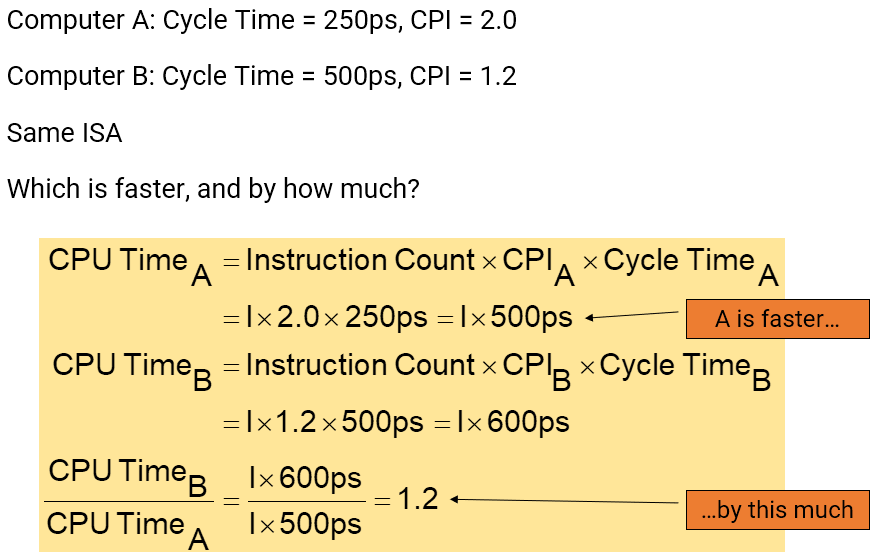

# Computer Performance

How the computer revolution has been archieved
- **Technology** and **architecture**
    - Moore's law : "The number of transistors incorporated in a chip will approximately double every 24 months"
    - Architecture
        - Exploiting parallelism in a single chip
            - Instruction level parallelism
                - **Pipelining, superscalar**, out-of-order execution, **branch prediction**, …
            - Data level parallelism (DLP)
                - SIMD instruction (media processing)
            - Task level parallelism (TLP)
                - Simultaneous multithreading (Hyperthreading)

        - Multicore microprocessors
            - More than one processor per chip
        - Requires explicitly parallel programming
            - Compare with instruction level parallelism
                - Hardware executes multiple instructions at once
                - Hidden from the programmer
            - Hard to do
                - Programming for performance
                - Load balancing
                - Optimizing communication and synchronization

- Power wall
    - Power = Cpapacity load x Voltage^2 x Frequency
    - 프로세서가 발전하면서 필요 전력량(Power)은 더 이상 높힐 수 없을 정도로 높아지며 발열문제를 겪고 있었고, 때문에 전력을 유지하면서 미세공정으로 전압 (Voltage)을 낮춰서 트랜지스터를 더 많이 집적하거나(Capacity Load) 클럭(Frequancy)을 더 높게 올리는 방식으로 성능을 개선했다. 그 이유는 전압의 경우 제곱으로 곱해지기 때문에 전압을 2배 낮추면, 전력은 4배 만큼 적어도 동일한 양의 Capacity Load나 Frequancy를 유지할 수 있다. 실제로 지금까지 CPU의 필요 전압은 점점 낮아져왔다. 하지만 어느순간부터 더 이상 전압을 낮추면 전류가 새어버리는 지경에 도달했고, 결국 더이상 전압을 낮출 수 없게 되면서 이 방법으로 성능을 확보하는게 어려워졌다. 이러한 현상을 학계에서는 전력 장벽 (Power Wall)이라고 부른다

Great ideas in computer architecture
- Design for **Moore’s Law**
    - The resources available per chip can easily double or quadruple between the start and finish of projects
    - Design architecture considering future performance
- Use **abstraction** to simplify design
    - To make computer architectures and programmers more productive
    - Represent the design at different levels of representation
- Make the **common case faster** (Amdahl's low)
    - Enhance performance better than optimizing rare cases
- Performance via **parallelism**
    - multiple engines for a plane
- Performance vis **pipelining**
    - Overlap intermediate results in execution
- Performance via **prediction**
    - Better to ask for forgiveness than to ask for permission
    - Guess and start working rather than wait until you know for sure
- **Hierarchy** of memories
    - Put small, fast units close while large, slow units away
- **Dependability** via redundancy
    - Include redundant components that can take over failures // 실패를 대신할 수 있는 중복 구성 요소 포함

Response Time and Throughput
- Response time = execution time
    - How long it takes to do a task
- Throughput = bandwidth
    - Total work done per unit time
        - e.g., tasks/transactions/… per hour
- How are response time and throughput affected by
    - Replacing the processor with a faster version?
    - Adding more processors?

Relative Performance
- Performance = 1/Execution Time
- “X is n time faster than Y” (Performance)
    
    

Measuring Execution Time
- Wall clock time, response time, or elapsed time
    - Total time to complete a task
    - Including all aspects such as processing, I/O, OS overhead, idle time
    - Determines the overall system performance
    - 즉, 컴퓨터가 실제로 작을 처리하는 데 걸리는 시간에 대해 사람이 인지할 수 있는 시간

- CPU execution time (or simply CPU time) 
    - Time the CPU spent processing a given job
        - Discounts I/O time, other jobs’ shares
    - Comprises user CPU time and system CPU time
    - Different programs are affected differently by CPU and system performanceWall clock time
    - 즉, 컴퓨터가 인지하는 시간

CPU Clocking
- Operation of digital hardware governed by a constant-rate clock
- Clock period: duration of a **clock cycle**
- Clock frequency (**Clock rate**): cycles per second
    - e.g., 4.0GHz = 4000MHz = 4.0×109Hz (4.0GHz) = 4.0GHz/s

CPU Time
    

- Performance improved by
    - Reducing number of clock cycles
    - Increasing clock rate
    - Hardware designer must often trade off clock rate against cycle count
        - E.g., CISC vs. RISC
    - 즉, 분모가 커지고 분자가 작아지면 CPU Time 감소

- CPU Time EXample

    

Instruction Count(IC) and CPI

- Clock Cycle Time = 1 / Clock Rate
- Cycles per Instruction n = CPI x Clock Cycle Time
        
    

- Instruction Count for a program
    - Determined by program, ISA and compiler

- Average cycles per instruction
    - Determined by CPU hardware
    - If different instructions have different CPI
        - Average CPI affected by instruction mix

    - CPI Example

    
    CPI = Clock Cycloes / Instruction Count
    

Amdahl's Law
- make the common case fast
- Improving an aspect of a computer and expecting a proportional improvement in overall performance

MIPS: Millions of Instructions Per Second
