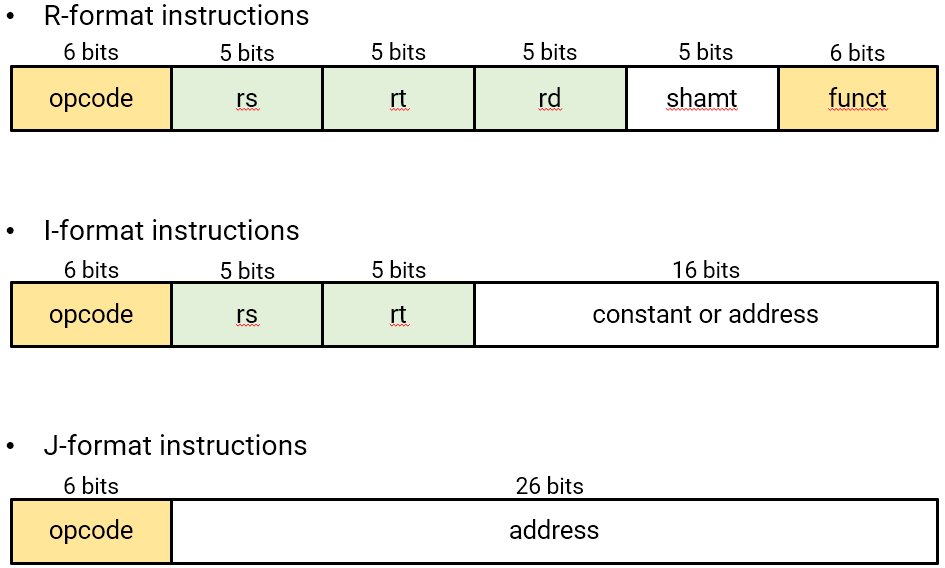

# MIPS ISA - Instruction Representation

## Index

- **Representing instructions**
    - R-format
    - I-format
    - J-format
- Logical operations
    - Shifts (<<, >>)
    - Bitwise operations
        - AND (&), OR (|), XOR(^), and NOT(~)
- Sign extension for immediate values

## start

MIPS instruction의 종류와 instruction이 어떻게 binary code로 바뀌는지 살펴보자. 사람과 컴퓨터는 소통해야 한다. 소통하는 과정은 크게 3가지로 볼 수 있다. High-Level Language ( C언어 ) 가 compiler를 통해 MIPS Assembly Language로 변환되고, Assembler를 통해 기계가 이해할 수 있는 Binary machine Language로 변환된다.
여기서 MIPS Assembly Language 단계에서 예를 하나 들어보자.     
ex)
    ```
    add $t0, $s1, $s2
    ```    
$s1 과 $s2 를 더해 $t0 에 저장하라는 뜻이다. 이것은 하나의 명령어, 즉 하나의 instruction이 될 수 있다. 이러한 MIPS instruction의 종류는 총 3가지가 있다.

- **Representing instructions**
    - Instruction들은 binary로 인코딩된다. 이 binary 코드들은 기계어(machine code)라고 불린다.

    - MIPS instructions
        - 32-bit의 word로 인코딩된다
        - 적은 종류의 포맷(규칙)으로 되어 있다 - operation code(opcode), register number, ...
        - regularity(규칙성)을 갖는다
    - 레지스터 번호
        - $t0 ~ $t7은 reg’s 8 -15
        - $t8 ~ $t9은 reg’s 23 – 25
        - $s0 ~ $s7은 reg’s 16 – 23

        

    📌**16bits인 opcode를 10진수로 바꾸는 과정 필수**
    - R-format
        - Arithmetic instruction format (산술 연산)
            - 레지스터 number를 이용하여 add, addu, and, sll, srl 등의 연산을 수행
        - 16진법 32bits로 구성
        - opcode, rs, rt, rd, shamt, funct로 분류
            - opcode : instruction이 수행할 연산의 종류. 연산자
            - funct :  function으로, opcode가 연산의 종류를 표현했다면, funct 필드는 그 중의 한 연산을 구체적으로 지정한다.
            - rd : 연산결과가 담길 레지스터 번호
            - rs : 피연산자1
            - rt : 피연산자2
        - From Assembly to Machine code
            1. ISA 매뉴얼[MIPS green sheet](https://inst.eecs.berkeley.edu/~cs61c/resources/MIPS_Green_Sheet.pdf) 참조
            2. 테이블에서 instruction 찾기
            3. format에 따라 instruction Encode
    - I-format
        - Immediate arithmetic과 load/store instructions에 이용되는 포맷
        - Rd가 없음.
        -  R format과 달리 16bits를 이용해 상수와 주소표현이 가능하다. 그래서 주소값을 가져오는 bne, beq, lw, sw 등의 분기문과 상수연산을 하는 addi, addiu, andi 등이 가능
        - opcode, rs, rt, constant or address로 분류
            - rt : destination(목적지) 혹은 source2(피연산자2) 레지스터 번호
            - constant : 표현범위는 -2^15 ~ 2^15 -1 이다.
            - address : offset으로 rs의 주소값으로부터 얼마나 떨어져 있나를 표시한다.
    - J-format
        - jump instruction format
        - opcode or address로 분류
            - Address: encodes 26-bit target address
- Logical operations
    - bit단위 조작을 위한 instruction
    - Shifts (<<, >>)
        - '<<' : 0비트로 2칸 왼쪽으로 민다. = * 2^n
            - MIPS instruction에서 sll로 표현
        - '>>' : 0비트로 2칸 오른쪽으로 민다. = / 2^n
            - MIPS instruction에서 srl로 표현
            - Unsigned only

    - Bitwise operations
        - AND (&), OR (|), XOR(^), and NOT(~)
            - AND : 비트를 숨기는데 유용
                - word에서 특정 부분의 비트들에 주목할 때 유용
            - OR : 기존의 word에 새로운 비트들을 포함하는데 유용하게 사용
            - XOR : 비트가 같다면 0, 그렇지 않으면 1
            - NOT : 각 비트를 바꾸는데 유용. (0을 1로, 1을 0으로). MIPS에서는 not operation이 없기 때문에 nor $t0, $t1, $zero이처럼 사용한다.
- Sign extension for immediate values
    - Representing a number using more bits
        - Preserve the numeric value
    - 부호 비트와 같은 값을 왼쪽으로 늘려주면 됨
        - c.f., unsigned 값: 0을 늘리면 됨


# Ref

- https://inyongs.tistory.com/121
- https://ydeer.tistory.com/140