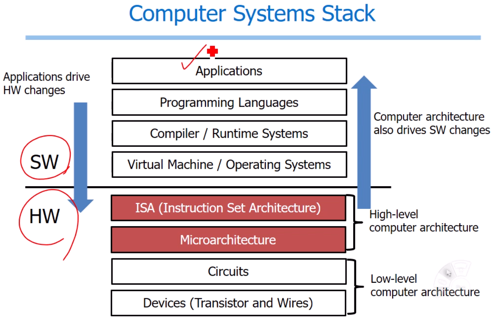
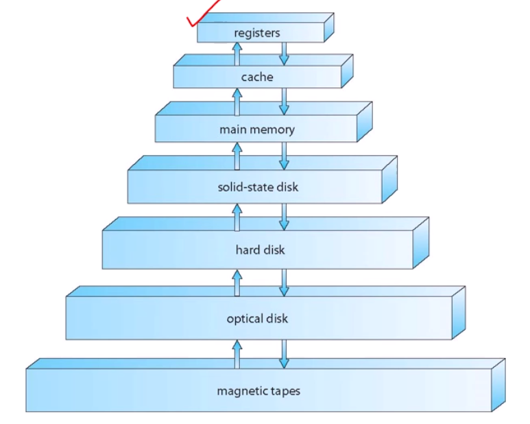
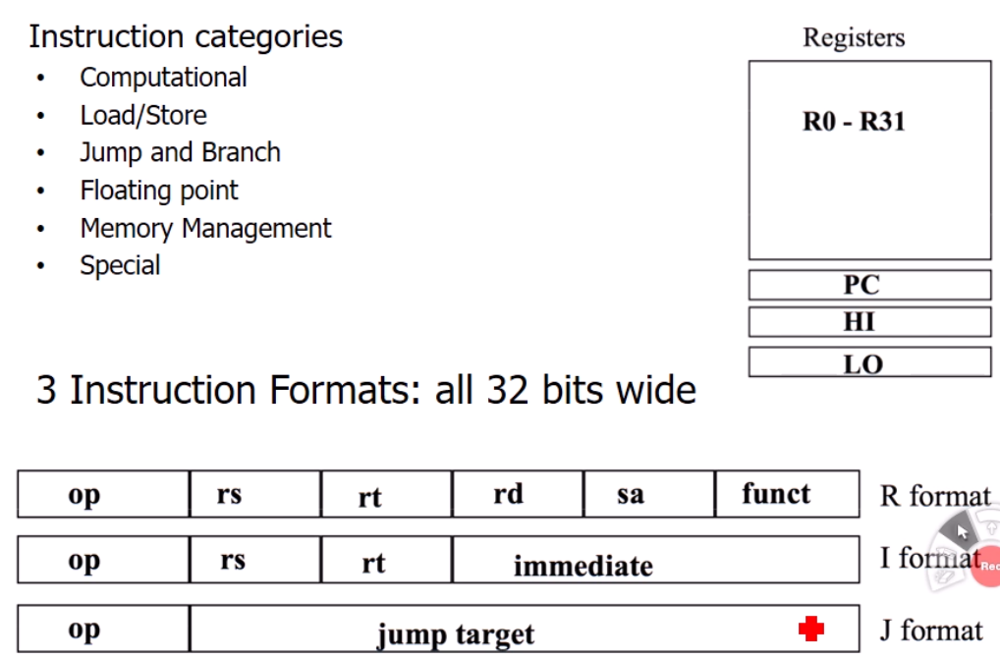

# MIPS Instruction Set Architecture

컴퓨터구조
- 사람이 만든 프로그램가 하드웨어에서 어떻게 소통하여 동작하는지의 원리에 대해 배우는 수업

## Computer System Stack

compiler : high level language -> low level language
assembler : low level language -> binary code

## Computer Architecture

2part 

part1. ISA
- 하드웨어와 소프트웨어의 인터페이스이다
- 호환성 문제때문에 변경되기 어려움 (무겁다)

part2. Microarchitecture
- ISA를 구현해놓은 것을 의미

널리사용되고 있는 ISA
- intel, AMD(Macbooks & PCs - core i3, i5, i7, M)
- ARM(iphone, ipad, Raspberry Pi)
- MIPS(프레이스테이션, 임베디드)

## Operation of Computer Hardware
- 컴퓨터는 수동적(passive)이어서 이미 만들어져 있는 것만 할 수 있다.

- 다른 컴퓨터는 다른 instruction set을 가지고 있지만(x86, Arm) 공통된 부분을 가지고 있다.

- 왜 MIPS인가? 현대의 ISA와 매우 흡사하고 교육용으로 적합하다

### MISP Arithemtic Operations
- 구현하기 간단하고
- 간단하므로 작은 비용으로 성능을 높일 수 있다
- Register Operands
    - 값을 저장하는 공간
        - Register : 프로세서 내부적으로 관리하는 저장공간
            - Arithmetic instruction을 수행
            - 32개의 32bit register가 있다
                - 자주사용디는 데이터
                - 0번 ~ 31번
                - word단위(32bit)
            - 메모리에 비하면 정말 적은 수이기때문에 빠르게 접근가능한 장점 
        - Memory(Dram)
            - MIPS 32 Meomry Operands
            - Arrays, structures, dynamic data
            - arithmetic operations을 하기위해
                - Load : memory -> regiters
                - Store : registers -> memory
            - byte단위로 움직이게 되어있다
            - MIPS는 Big Endian이다
    - MIPS 32 Registers
        - [참고](./Procedures.md)

- MIPS에서는 데이터 연산을 하기위해 메모리에 있는 값을 레지스터로 불러온다. 연산한 이후 결과를 메모리에 저장해준다.
    - 왜이렇게 할까? 연산기는 프로세서 안에 있기 때문에 메모리에서 접근하는 것보다 레지스터에서 접근하는게 빠르기때문이다 
    - 따라서, 컴파일러는 variable에 대해 되도록이면 레지스터를 많이 사용해야한다
- MIPS Immediate Instructions
    - 상수값을 활용하여 계산 (addi)
    - 일반적인 상황(loop, define)에서 빠르게때문에 사용됨

## Memory Hierarchy

- main memory는 컴퓨터 전원을 끄면 사라지기 때문에 밑에 hard disk, ... 가 존재한다
- 아래로 내려갈 수록 사이즈가 커지면서 느리다
- register가 가장 빠르게 기억할 수 있는 공간이고
- magnetic tapes은 가장 많은 양을 기억할 수 있는 공간이다.
- 보통 registers와 cache가 CPU를 구성하고
- main memory는 DRAM으로 구성하고
- 요즘은 hard disk를 잘 안쓰고 ssd를 사용한다

## MIPS-32 ISA

- Registers에 32개의 register외에 PC / HI / LO도 있다
    - PC(Program Counter) : instruction pointer
        - 컴퓨터 프로세스는 state machine(하나의 instrucion수행 -> 어떤 state 세팅 반복)이기 때문에 PC가 수행할 instruction memory 주소를 가지고 있다
    - HI / LO : 32bit곱을 하면 값이 커질 수 있기 때문에 쓰임
- Insruction Format은 크게 3개로 나뉨
    - **모든 Insruction은 항상 32bit이다**
        - 이때문에 어떤 instruction은 필요한 정보를 다 포함하지 못할 수도 있고 낭비 될 수도 있다. 하지만, tradeoff가 가능하다. 이는 추후에 학습

# 강의요약
어떻게 high level language(C code)가 MIPS instruction set에서 제공하는 Assembly형태로 변한되는지에 대해 살펴보았다