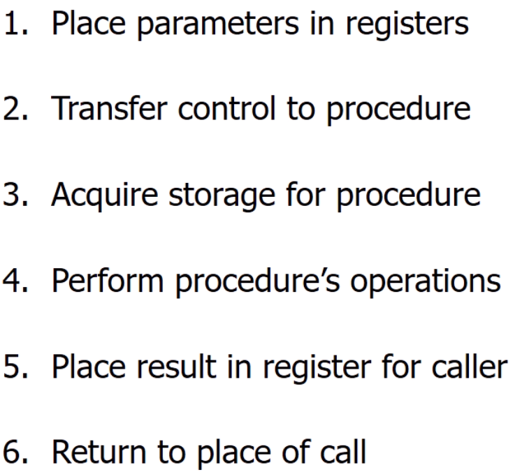
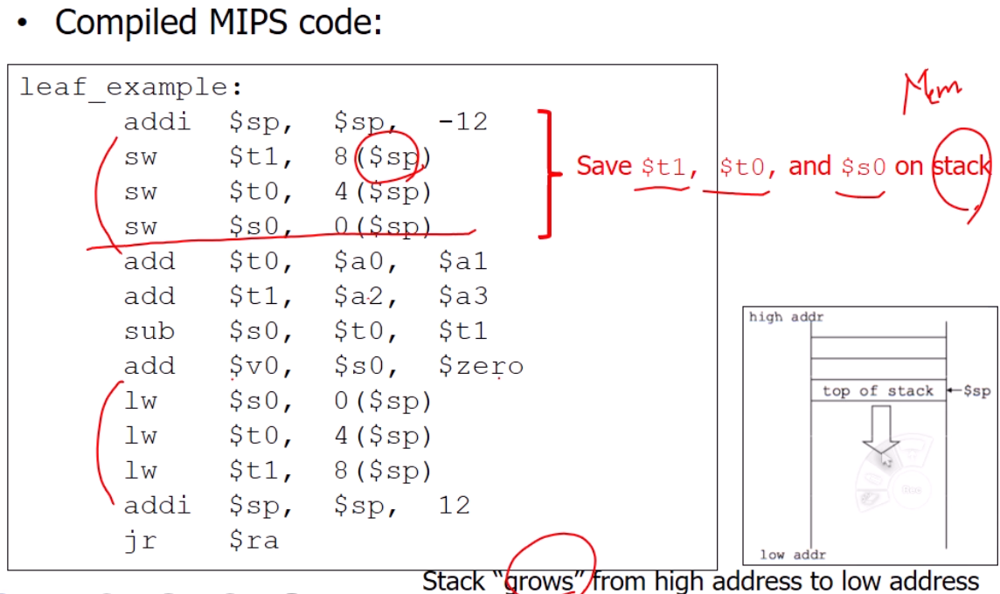
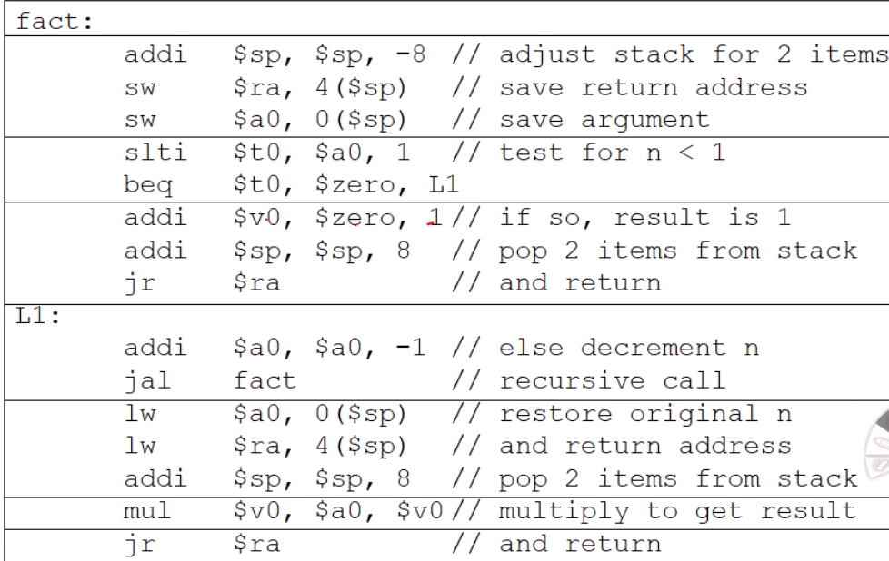
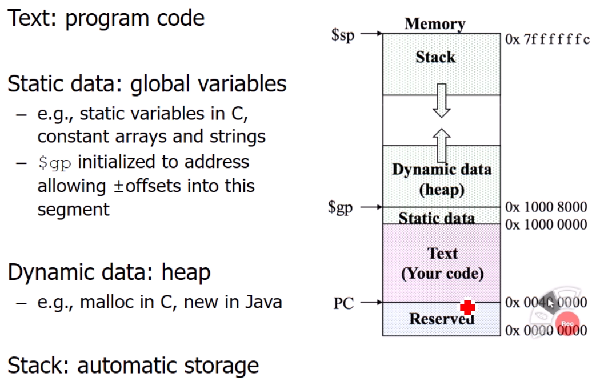

# Procedure

프로그램을 구성하는데 필수적으로 함수가 쓰인다. 함수를 호출함에 있어서 하드웨어가 어떻게 달라지고 support가 되는지 살펴볼 것이다.
= 어떻게 컴퓨터 하드웨어안에서 프로시저를 지원하고 있는지를 알아보자

📌이번 강좌에서는 프로시저와 함수를 같은 의미로 쓸 것이다.
## Procedure calling (=함수 호출)

1. 함수가 파라미터를 받는 경우를 위해서, 전달하는 파라미터를 레지스터에 넣는 단계
2. 현재 수행중인 함수에서 컨트롤울 호출된 함수로 전달
3. 프로시저를 위한 메모리 공간 확보
    - 프로시저에 있는 로컬 메모리 , 배열 ...이 있으므로
    - 함수 안에 레지스터를 화보할 공간
4. 함수 안 계산 실행
5. 함수에 리턴 값이 있을 때, caller에 넘겨주기위해 결과값을 레지스터에 올리는 단계
6. 컨트롤을 caller로 리턴한다

### Procedure call Instruction
- Procedure call: jump and link
    - jal
    - $ra에 jal 다음 instruction의 시작 주소를 알려줌
- Procedure return: jump register
    - jr
    - $ra에 있는 값을 PC에 넣어줌

### Leaf Procedure
- 자기자신을 호출하지 않는 함수

- main(caller)에 이미 $t1, $t0, $s0가 쓰였을 수도 있으므로 stack(memory)에 넣고(sw) 연산 해준 후(procedure body) 다시 stack에서 빼준다(lw)
- 여기서 stack은 높은 주소에서 낮은 주소로 증가하는 형태
- optimize된 형태로 temporary 레지스터($t0,...)는 stack에 저장하지 않는다.
    - 가장 큰 이유는 레지스터에 있는 내용을 스택에 저장하고 불러올 때, 메모리의 읽고쓰고하는 작업이 일어난다. -> 이를 최대한 줄이는 것으로 temporary레지스터를 stack에 쓰지 않는게 좋다 

### Non-leaf Procedure
- 프로시저안에서 다른 프로시저를 호출 (recursive)
- 왜 recursive함수가 비용이 비쌀까?
    - overwrite될 수 있는 변수(로컬) 즉, 레지스터 정보를 스택에 저장해놓고 나중에 가져오는 작업이 빈번하게 발생하기때문에 메모리 연산이 자주 일어나고 성능이 늘어날 수 있다
- factorial ex

    

## Memory Layout

- stack : 위 -> 아래
- heap : 아레 -> 위