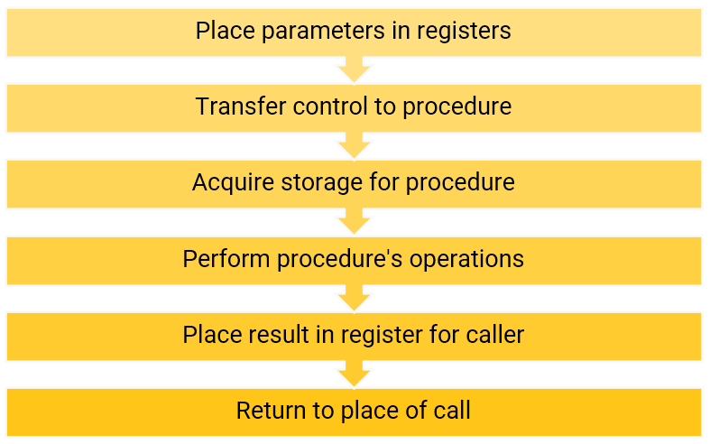
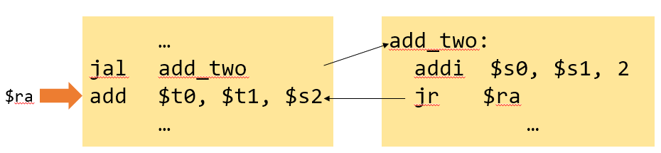
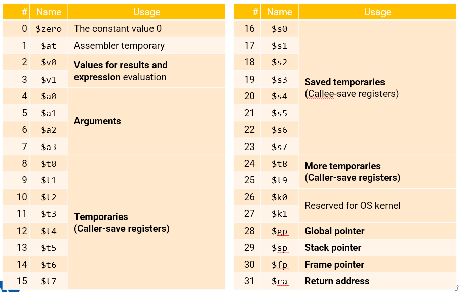
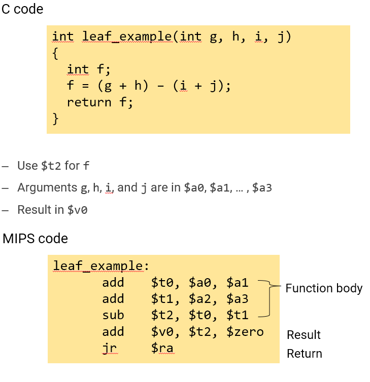
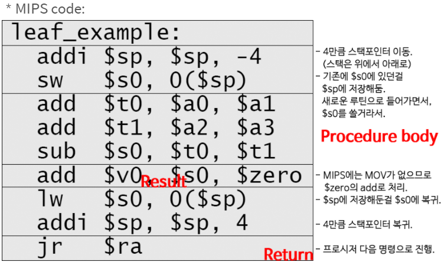
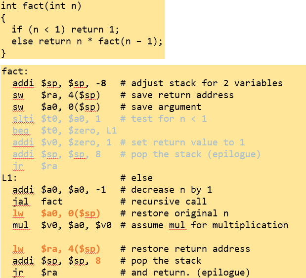
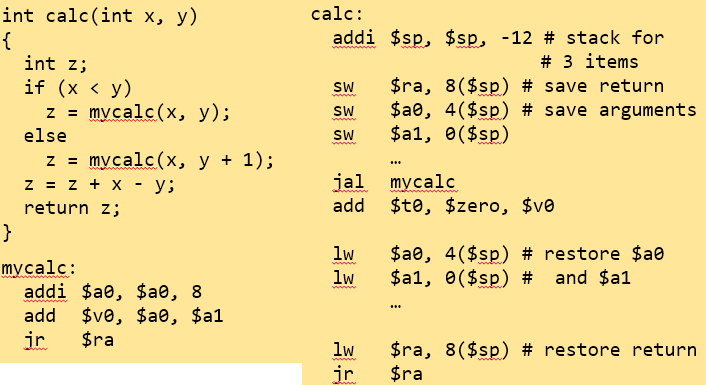
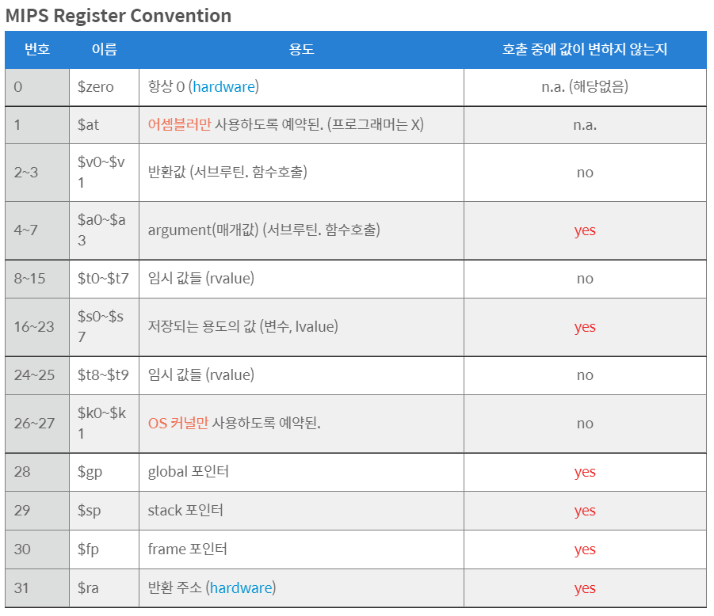

# Procedures

## Index

- Conditional branch
    - beq, bne, j, slt, …
- And Function call
    - jal(call), jr (return)
    - Callee-save vs. caller-save registers
    - Memory layout of a program: code, data, heap, stack($sp, $fp)
    - Prologue and epilogue to save/restore registers
- In fact, labels should be translated to addresses


## start

- 프로시저 호출 단계
    - 프로시저(함수(function). 어떤 작업.) 실행의 6가지 단계

    

    1. 메인 routine[Caller]이 파라미터(매개값)를 프로시저[Callee]가 접근가능한 곳에 위치시킨다.
        - **$a0~$a3**: 매개값을 위한 4개의 레지스터
    2. Caller가 제어권(control)을 Callee에게 넘겨준다.
    3. Callee는 필요한 storage(메모리)를 얻는다.
    4. Callee는 요구되는 일(하기로 된 서브루틴 작업)을 수행한다.
    5. Callee는 결과값을 Caller가 접근가능한 곳에 위치시킨다.
        - **$v0~$v1**: 결과값을 위한 2개의 레지스터
        - Caller reads those results by accessing the registers after returning from a function call
    6. Callee는 제어권(control)을 Caller에게 반납한다.
        - $ra: 하드웨어가 사용하는, 반환 주소를 위한 레지스터. Caller에게 제어권을 주기 위한 주소.

    - Procedure Call Instructions
        - 프로시저 호출(call): jal(jump and link) (※ 그냥 점프는 j였음)   
        ``` jal　"Procedure Label" ```
            - 바로 다음에 올 instruction의 주소를 $ra에 담는다.(프로시저(서브루틴)가 종료되면 다음으로 진행되기 위해)
            - target address(프로시저가 수행되기 위해 label 된)로 점프
                - $PC <- target address
        - 프로시저 리턴(return): jr(jump register)      
        ```jr　$ra```
            - 프로그램 카운터(program counter, PC)에 $ra를 복사한다.
                - (PC는 현재 실행하고 있는 명령의 메모리 주소가 담기는 레지스터. 즉, 프로시저 다음의 명령 주소로 돌아와 계속 진행하려는 것.)
            - jr은 computed jump에 사용되기도 있다.
                - e.g., case/switch 구문에

        

- MIPS Resgisters

    

- Leaf Procedure Ex
    - 함수 내에서 다른 함수를 호출하지 않음

    
    

- None-Leaf Procedure Ex
    - 프로시저 내에서 다른 프로시저를 호출하는 형태
    
    
    

- Register Conventions
    - 실제로 컴파일러는 기능별 및 기본 블록별로 소스 코드를 번역합니다.
    - 각 기능에서 레지스터는 계산을 위해 할당됩니다.
    - 그러나 MIPS에는 32개의 레지스터만 있습니다.
    - Caller-save registers ($t0– $t9)
        - 값은 함수 호출에서 보존되지 않습니다. 따라서 호출자는 함수를 호출하기 전에 레지스터 값을 저장하고 값을 보존하기 위해 반환 후에 복원해야 합니다.
            - 호출자는 레지스터 값을 저장합니다.
    - Callee-save registers ($s0–$s7)
        - 필요한 경우 레지스터를 사용할 수 있지만 반환하기 전에 원래 값으로 복원해야 합니다.

        

- Memory Layout of a Program
    - Code (Text)
        - 프로그램 코드 (instruction들)
        - pc(program counter)가 이 영역에서 움직이면서 현재 실행될 instruction을 가리킨다
    - Static data (Data)
        - 전역 변수들
        - static 변수, constant array나 string, ...
        - $gp(global pointer)는 Static data를 가리키기 쉽도록, Text의 끝과 Dynamic data의 시작의 중간에 위치하여, ±offset으로 데이터를 가리켜 준다. (MIPS에서는 중간. 다른 프로세서는 다르게 동작할 수도 있음.)
    - Heap
        - Grow downward
        - heap 메모리에 할당
        - C에서 malloc, Java나 C++에서 new, ...
    - Stack
        - Grow upward

- Local Data on the Stack
    - 프로그램에서 프로시저(function)가 호출 될 때 메모리가 어떻게 할당되는지

    - $fp points to the base of the current **stack frame**
        - “Stack frame” =  procedure frame, activation record
        - $fp에서 $sp까지. 하나의 function을 실행할 때 할당되는 메모리 공간
    - $sp points to the **“top”** of the stack, or the last word in the stack

- Handling Procedure Calls
    - 코드 컴파일 동안 컴파일러는 각 함수의 스택 프레임 크기를 계산합니다.
        - This function needs 32 bytes for its stack
    - Generate assembly code to populate the stack frame (**function prologue**)
        - E.g., $fp = $sp; $sp = $sp - 32
    - Determine the addresses for saved local variables and registers relative to $sp and/or $fp
        - E.g., $s0 at $sp+4, $ra at $sp+8
    - Generate assembly code for the function body
        - Use registers according to the register conventions
    - Before return, all callee-save registers are restored to its original values
        - E.g., Restore $s0 with $sp+4, $ra with $sp+8
    - Pop stack frame (**function epilogue**)
    - jr


# Ref
- https://ydeer.tistory.com/140
- https://velog.io/@limdongyoung0/computer-architecture-2-5