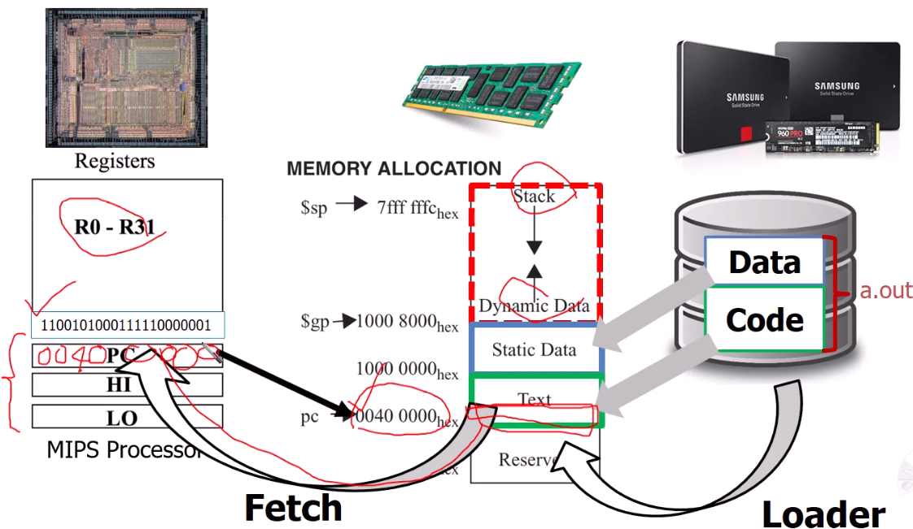

# Instruction Execution

- instruction을 가져온다.
    - PC로 instruction memory값을 가져옴
- instruction을 이해 (decode)
- register를 읽음
- instruction class에 따라
    - 계산하기위해 ALU사용
    - load/ store라면 메모리에 접근
    - PC : PC + 4 주소값을 가짐

# A Big Picture

PC / Memory / Storage 그림 순

## Multiplexers
입력이 여러개인데, 그 입력 중 어떤 입력을 취할건지 하드웨어 로직

## Control
- decoding하여 하드웨어에 전달
- multiplexers 로직을 결정

## Combinational Elements
- AND-gate
- Adder
- Multiplexer
- Arithmetic/Logic Unit

## Datapath
- 데이터가 왔다갔다하는 통로 
- Registers, ALUs, memories...

### Instruction Fetch

### R-Format Instructions

### Load/Store Instructions
