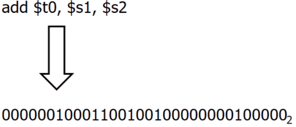
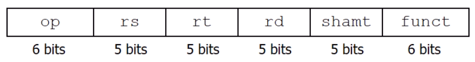
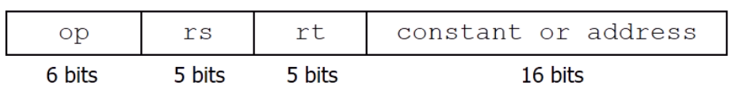
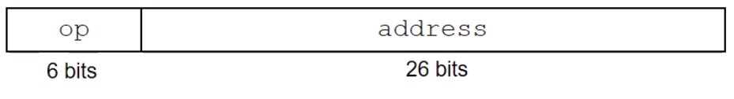
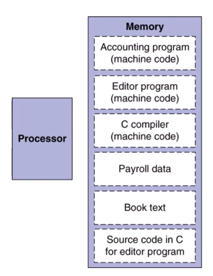

# Representing Instructions

- 위의 instruction은 사람이 이해할 수 있는 assembly code이다
- 밑의 binary형태를 기계가 기억할 수있는 machine code이다
- 어떻게 변환 될까? class focus
- instruction은 binary형태로 encode되고 이는 memory에 저장이 된다

MIPS R-format Instructions

- 이러한 규칙이 정해지고 바뀌지 않기때문에 하드웨어는 해석하기만 하면된다
- add, sub ...

MIPS L-format Instructions

- load, store ...

MIPS J-format Instructions

- j, jal

위의 3 Instruction format은 앞의 opcode를 통해 컴퓨터가 구분할 수 있다
## Stored Program Computers

- 컴퓨터는 연산장치인 processor와 기억장치인 memory로 구성되어 있다
- 보통 실행되는 프로그램은 메모리에 존재한다
    - 구체적으로, hard disk or ssd ...에 저장이 됨
- 프로그램은 명령어(instruction)와 데이터로 구성되어 있고 이러한 instruction과 data는 메모리 입장에서 binary형태로 저장되어 있는 데이터이다
- 프로그램 ex) 컴파일러, 링커...
    - instruction을 읽고 처리 반복
- binary compatibility
    - 컴파일된 프로그램은 서로 다른 컴퓨터에서 수행할 수 있도록 해주는 개념
    - ISA가 같을때, 다른 컴퓨터에서 사용가능
## Instruction for Making Decision
- 분기문관련
- conditional operations
    - beq (=)
    - bne (!=)
- unconditional operations
    - j (goto)
- Branch Instruction Design
    - 하드웨어 입장에서 대소비교를 하는 것보다 =, != 를 처리하는게 더 편하고 빠르다
    - 따라서 blt, bge와 같은 instruction이 존재하지 않음

## Basic Block
- 중간에 branch가 없는 sequence of instruction
- compiler는 처음 코드를 스캔하면서 basic block단위로 코드를 자른다. 중간에 branch가 없으므로 많은 optimization을 할 수 있게 된다.