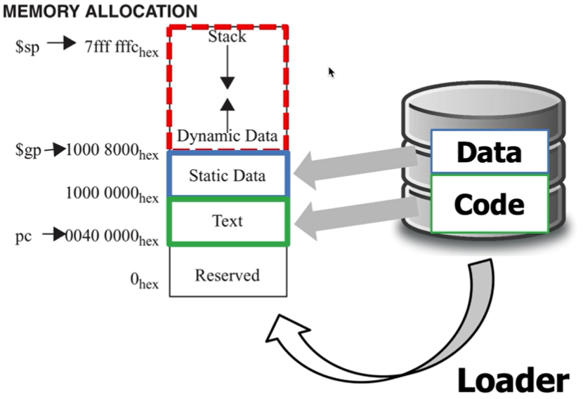

# Translating and starting a program

## The C code Translation Hierarchy
프로그램이 어떻게 시작되는가?

통상적으로, 많은 컴파일러들이 object modules을 직접 생산한다.     
정확히는,
1. gcc 또는 VScode의 compiler를 사용하는 것은 C high-level프로그램을 assembly코드로 바꾼다.
2. assembly언어를 machine 언어로 바꾸는 것은 assembler가 한다.
3. 이후, object file이 여러개 나올 수 있는데 링커를 통해 링킹과정으로 만들어진 것을 실행파일이라고 한다.
4. 실행파일이 로더에 의해 메모리에 올라가고 OS에 의해 올려놓은 프로그램이 수행된다.

ex) 엑셀프로그램을 실행 시킬 때, 엑셀프로그램에 대한 바이너리가 이미 만들어져서 컴퓨터 하드디스크에 저장이 되어 있을 것이다. 그것을 실행하면 그 바이너리에 대한 내용이 메모리에 올라오고 운영체제가 실행시킨다.

+) virtual address space
    - 프로그램잉 로딩할때 만들어진다.
    - 컴퓨터는 여러개의 프로그램을 쓰고 있는데, 각 프로그램들이 마치 혼자 컴퓨터를 사용하고 있다는 착각을 만들어주는 것
        - 컴퓨터의 메모리를 나 혼자쓰고 있다고 착각하게 해준다.

## Assembler Pseudo Instructions
대부분의 어셈블러 instruction은 머신 instruction을 1:1 매핑해서 사용한다.

## From Program to Process
executable file을 만들면 code와 data가 하드디스크안에 있다.
- 프로그램 설치 후, 실행하는 것을 "프로그램을 프로세스화해서 만들었다"고 한다.
- 즉, 프로그램 실행하면 code와 data가 Loader에 의해 메모리상에 올려 놓는다.

    

- virtual address space: 메모리는 한정되어 있지만, 메모리가 무한정하다는 착각을 주는 행위
- stack과 Dynamic Data는 런타임때 생성되므로 executable file(사진의 오른쪽)이 없다

+) MIPS
    - RISC 스타일
        - ex) x86
        - 예전에는 컴퓨터가 좋은 컴파일러가 없고, 메모리가 작아서 쓰였다.
    
vs)  CISC 스타일
        - ex) ARM
        - 컴퓨터 발전에 따라 메모리 좋고, 컴파일러 좋아져서 instruction set을 간단히 만들자해서 출현 