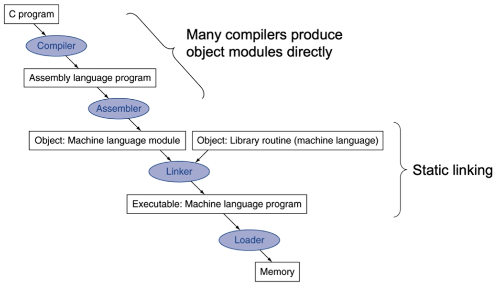

# Translating and starting a program

프로그램이 어떻게 시작되는가?

통상적으로, 많은 컴파일러들이 object modules을 직접 생산한다.     
정확히는,
1. gcc 또는 VScode의 compiler를 사용하는 것은 C high-level프로그램을 assembly코드로 바꾼다.
2. assembly언어를 machine 언어로 바꾸는 것은 assembler가 한다.
3. 이후, object file이 여러개 나올 수 있는데 링커를 통해 링킹과정으로 만들어진 것을 실행파일이라고 한다.
4. 실행파일이 로더에 의해 메모리에 올라가고 OS에 의해 올려놓은 프로그램이 수행된다.

ex) 엑셀프로그램을 실행 시킬 때, 엑셀프로그램에 대한 바이너리가 이미 만들어져서 컴퓨터 하드디스크에 저장이 되어 있을 것이다. 그것을 실행하면 그 바이너리에 대한 내용이 메모리에 올라오고 운영체제가 실행시킨다.
