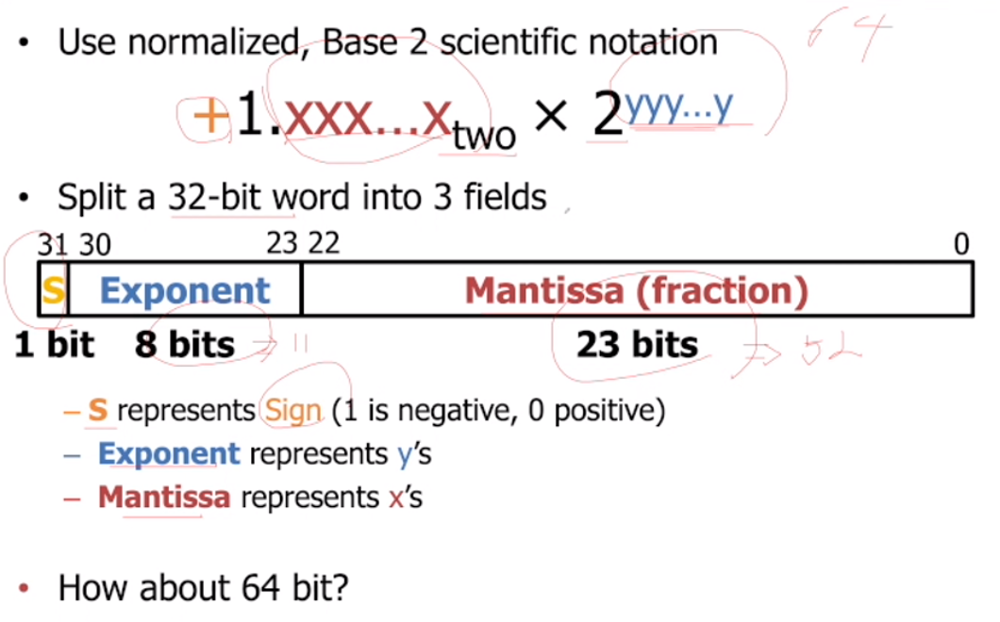
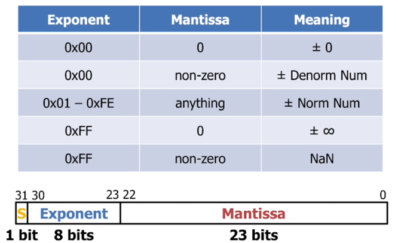

# floating foint

- scientific notation
    - normalized
        - 소수점 앞은 하나의 수. 단, 0이 아니어야 한다.(1 - 9)
    - not normalized
        - 표준없이 표현 방법이 다름
- In binary
    - ``10.1010 = 1x2^1 + 1x2^(-1) + 1 x 2^(-3)`` = 2.625 // 십진수
    - ``1.011 x 2^4 = 1011.0`` = 22 // 십진수
    - ``1.011 x 2^(-2) = 0.01011`` = 0.34375 // 십진수
    - ``1101.001 = 1.101001 x 2^3``

## Floating Point Encoding
검은색: 고정되어 있는 부분

### Exponent Field
**biased notation을 사용한다**
- 8비트인 exponent를 음수로도 표현할 수 있다. 기존의 수 체계를 따르지 않음.
- 0이 기존에 0000 0000이라면 127(0111 1111)이 0이다.
- ``2^1 , exp = 1 -> 1 -> 128 -> 1000 0000``
- ``2^127 , exp = 127 -> 254 -> 1111 1110``

## Precision and Accuracy
- precision : 비트의 수
- accuracy : 컴퓨터 값과 실제 값의 차이
- precision이 많다고 accuacy가 증가하지 않음

## 계산 정리
1. normalized 값으로 바꿔준다.
2. 부호값, exp, man을 32비트에 적절히 넣어준다.
3. 단, exp의 값을 그대로 들어가지 않고 biased형태로 들어간다.

# special case
1. Zero
    - normalized 상태로 표현하면
        - 0x00000000 = 1.0 x 2^(-127)
        - 하지만, 정확한 0이 아니다.
    - exp와 man을 모두 0

2. non-zero
    - 매우작은 수는 어떻게 표현하지?
    - denormalized 형태로 표현하자
        - exp = 0 , man != 0
    
3. 0이 아닌 수를 0으로 나누게 되었을 때, 무한대 발생

## Floating Pint Numbers Summary

## FP -> 십진수
0/0110 1000/101 0101 0100 0011 0100 0010
- Sign : 0 (+)
- Exp : 0110 1000 = 104
    - 104 - 127 = -23
- Man : 101 0101 0100 0011 0100 0010
    - 1 + 2^(-1) + 2^(-3) + 2^(-5) ...
    - 1 + 0.666115
- represents : 1.666115 x 2^(-23)

## 십진수 -> FP
1/3
- 0.33333...
- ...