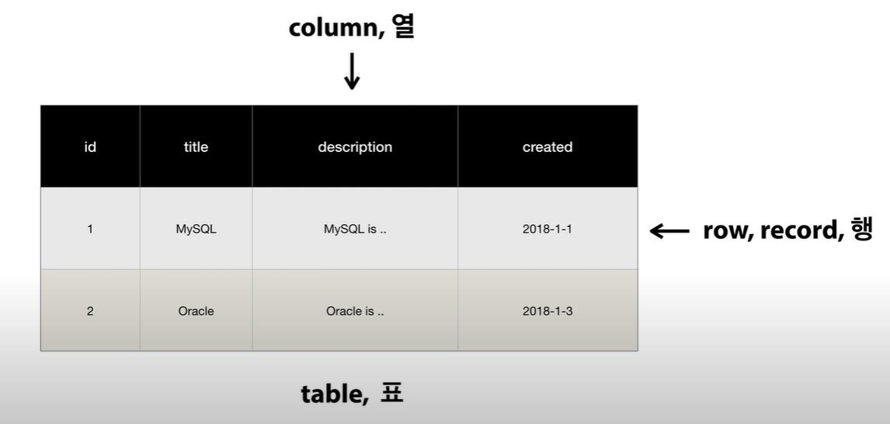

## MySQL

- Relational Database Management System (RDBMS)

- 데이터 베이스
    - 한 곳에 저장된 정보들을 원하는 어떤 곳에서든 사용할 수 있다. 즉, 특정 소프트웨어 및 프로그램에 종속되지 않고 독립된 정보의 집합(저장소)이다.
    
- DBMS (Database Management System)
    - 정보를 넣고 빼는 각종 기능을 넣어 원하는 것을 기능별로 쓸 수 있는 하나의 소프트웨어이다.
    - 저장하는 방법 - SQL(structed Query Language)

- 문자열과 숫자를 연산할 경우 문자열은 0 취급
    - 단, 숫자로 구성된 문자열은 숫자로 자동인식

- 테이블 

- 주의
    - 데이터를 봤을 때 데이터가 중복되고 있다면 개선할 필요가 있다.
        - 수정시 불편, 데이터 낭비
        - 테이블 분리하여 id값으로 참조
            - 장점
                - 유지보수👍
                - 동명이인에 대한 처리👍
            - 단점
                - 직관적이지 않다
            - 단점 극복
                - SQL문을 통해 저장은 분산을 통하여, 보여줄때는 합쳐서 보여줄 수 있다. 

### 관계형 데이터 모델링
- 데이터 모델링
    - 문제를 현실과 분리 -> 추상화 과정 -> 컴퓨터의 세상으로 옮긴다
- 과정
    1. 업무파악
        - 하고자할 일의 정확한 파악
        - 기획서 산출
    2. 개념적 데이터 모델링
        - ER 다이어그램
            - [draw.io]()
        - 정보(attribute = column) + 그룹(entity = Table) + 관계(Relation = PK,FK)
            - +) Tuple = Row
        - entity : 다른 directory를 품을 수 없고 file만 품을 수 있는 directory
    3. 논리적 데이터 모델링
        - ER 다이어그램의 그림을 관계형 데이터 모델로 전환 작업 [ER Master]()
        - 하지만 엑셀이나, 종이로 하는게 더 편함.
        - 표로 전환
    4. 물리적 데이터 모델링
        - SQL코드

- 명령어
    - GROUP BY
        - 조건에 따라 집계된 값을 가져온다
        - 어떤 테이블의 특정 행을 그 안에 **겹치지 않는** 모든 값들을 골라 뽑는다
        - 쓰는 이유는 MAX MIN COUNT SUM AVG와 같은 그룹 함수를 함께 쓰기 위함
    - WITH ROLLUP
        - 모든 값을 합함
        - ODER BY와 함께 쓰일 수 없다.
    - HAVING
        - 조건문
        - HAVING vs WHERE
            - HAVING은 그룹 후 집계에 사용된다 - GROUP BY아래에 존재
            - WHERE은 그룹하기 전 데이터 - GROUP BY위에 존재 (우선 판단)
    - DISTINCT
        - 중복된 값을 제거
        - GROUP BY 와 달리 집계함수가 사용되지 않습니다.
        - 정렬하지 않기때문에 빠르다 
        - ODER BY로 수정 가능
    - GROUP BY와 DISTINCT 함께 활용하기
        ```
        SELECT
            Country,
            COUNT(DISTINCT CITY)
        FROM Customers
        GROUP BY Country;
        ```
- 상관서브커리와 비상관서브커리

- JOIN

- UNION
    - UNION : 중복을 제거한 집합
    - UNION ALL : 중복을 제거하지 않은 집합

- Practice
    - [SQL Prac](https://www.w3schools.com/mysql/trymysql.asp?filename=trysql_select_all)
    - https://www.yalco.kr/lectures/sql/