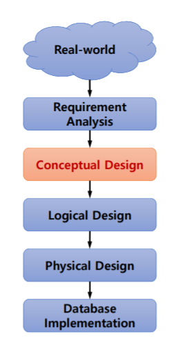
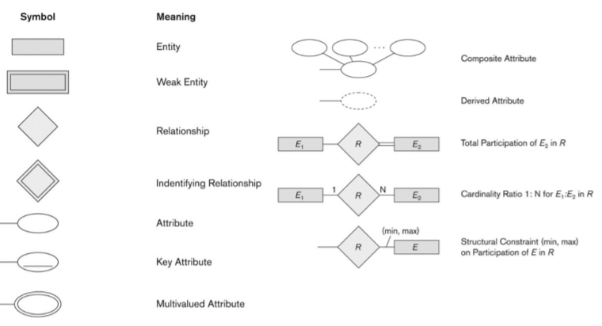
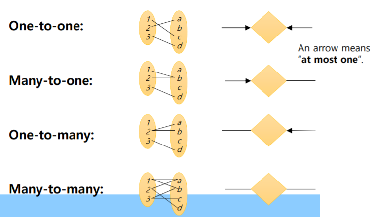

# intro
- Database
    - Collection of related data (recorded facts)
- DBMS
    - Generalized software package for implementing and maintaining a computerized database
- Characteristics of the database approach
- Types of database users
- History of database
    - Database applications have evolved
- When not to use a DBMS

# DB system concepts and Architecture

## Index
- Data Models and Their Categories
- History of Data Models
- Schemas, Instances, and States
- Three-Schema Architecture
- Data Independence
- DBMS Languages and Interfaces
- Database System Utilities and Tools
- Centralized and Client-Server Architectures
- Classification of DBMSs

## start

Data Models
- An abstract model with **structures(구조)** + **operations(작업)** + **constraints(제약)**
    - 구성은 include **elements** (and their data types) as well as groups of elements (e.g. **entity, record, table**), and **relationships** among such groups

    - operations : 데이터베이스 검색 및 데이터 모델의 구성을 참조(retrievals)하여 업데이트
        - basic model operations
        - user-defined operations

Categories of Data Models
- Conceptual (high-level, semantic) data models
- Physical (low-level, internal) data models
- Implementation (representational) data models
- Self-Describing Data Models

Schemas vs. Instances
- Database Schema
    - 데이터베이스에 대한 설명
- Schema Diagram
    - 데이터베이스 Schema(대부분의 aspects) 설명 표시
- Schema Construct
    - A component of the schema or an object within the schema,
    - e.g., STUDENT, COURSE
- Database State
    - 특정 시점(**particular moment in time**)에 데이터베이스에 저장된 실제 데이터 시각

Database Schema vs. Database State
- Database Schema
    - The database schema changes very **infrequently**
    - Schema is also called intension.
- Database State
    - The database state changes **every time** the database is updated
    - State is also called extension.

Three-Schema Architecture
- Internal schema
    - 물리적 스토리지를 설명하는 내부 수준의 내부 스키마 구조 및 액세스 경로(예: 인덱스)
    - Typically uses a physical data mode
- Conceptual schema
    - 구조를 설명하기 위한 개념적 수준의 개념적 스키마 사용자 커뮤니티의 전체 데이터베이스에 대한 제약 조건
- External schemas
    - 다양한 사용자를 설명하기 위한 외부 수준의 외부 스키마
견해

- 요청(request)과 데이터를 변환하려면 스키마 수준 간의 **매핑**이 필요하다

DBMS Languages

- Data Definition Language (DDL)
- Data Manipulation Language (DML)
    - 데이터베이스 검색(retrievals) 및 업데이트를 지정하는 데 사용
    - 타입
        - High Level or Non-procedural Language
            - the SQL relational language
        - Low Level or Procedural Language
            - Retrieve data one record-at-a-time

DBMS Programming Language Interfaces
    - Scripting Languages: PHP (client-side scripting) and Python (server-side scripting)
are used to write database programs

# Data modeling and ER model 1

## Index
- Overview of Database Design Process
- Example Database Application (COMPANY)
- ER Model Concepts
    - Entities and Attributes
    - Entity Types, Value Sets, and Key Attributes
    - Relationships and Relationship Types
    - Weak Entity Types
    - Roles and Attributes in Relationship Types
- ER Diagrams - Notation
- ER Diagram for COMPANY Schema

## start

Overview of Database Design
- 1. Requirement analysis via informal discussion with user groups
- 2. Conceptual design: ER diagram vs. UML
    - Entity and Relationship, Constraints
    - Commercial tools: ERWin, Oracle Designer,
IBM Rational Rose, and so on
- 3. Logical design: RDB schema
    - TABLE A(a,b,c), B(d,e,f), C(….), …..
    - Constraints for tables
- 4. Physical design
    - Create Table (a,b,c);
    - Index, block size, disk allocation, etc.

    

NOTATION for ER diagrams

Entities and Attributes
- Entity: 
    - Specific things or objects in the mini-world that are represented in the database
    - e.g., EMPLOYEE John Smith, the Research DEPARTMENT, the ProductX PROJECT
- Attribute:
    - Attributes are properties used to describe an entity
    - e.g., an EMPLOYEE entity may have the attributes Name, SSN, Address, Sex, BirthDate

Relationships

- A relationship
    - relates two or more distinct entities with a specific meaning
    - For example, EMPLOYEE John Smith works on the ProductX PROJECT, or EMPLOYEE Franklin Wong manages the Research DEPARTMENT
    - Diamond-shaped box
    - Needs to specify certain relationship constraints. 
        - One-to-one (1:1), One-to-many (1:N), Many-to-one(N:1), Many-to-many (M:N)
        
        

Total vs. partial participations

- 전체 참여를 실존적 의존성이라고도 합니다.
    - 최소 참여를 지정합니다.
    - 하나 이상(필수 참여, 존재 종속)
    - mandatory, existence-dependent
- 부분적 참여는 0일 수 있습니다(선택적 참여, 존재에 종속되지 않음)
- 엔터티가 관계에 전체 참여가 없는 경우 부분 참여라고 합니다
- Total participation is represented by a double line between the relationship and the entity.
- Participation constraint: total or partial relationship
    - Total: double line, partial: single line

Weak Entity Types
- A weak entity
    - 키 속성이 없고 다른 엔터티 유형에 따라 식별 종속적입니다.
    - 약한 엔터티는 소유자와의 식별 관계 유형 또는 식별 엔터티 유형에 참여해야 합니다.
    - 엔터티는 다음 조합으로 식별됩니다.
        - 약한 엔터티 유형의 부분 키(partial key)
        - 식별 관계 유형에서 관련된 특정 엔터티(particular entity)