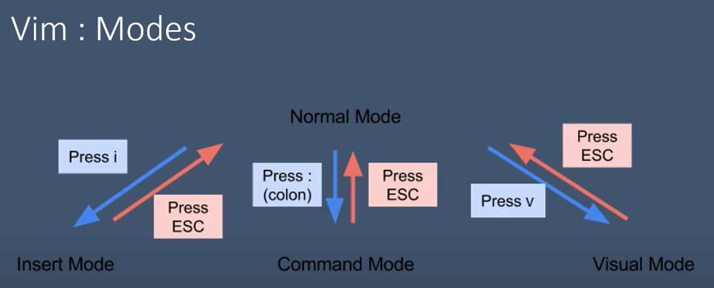
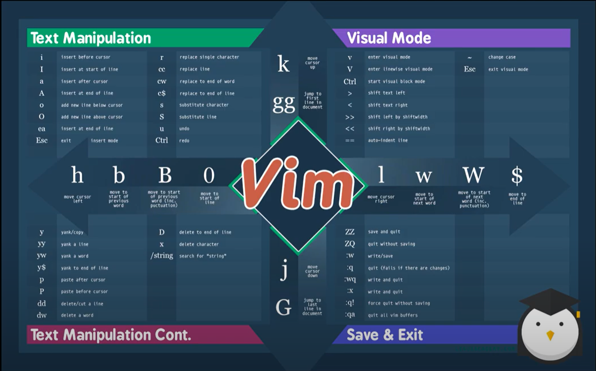

# VIM

Text Editor - vi compatible

https://www.raddit.com/r/linux4noobs/comments/awjzuo/vim_cheat_sheet/

 - ⬅(R) : H
 - ➡(L) : L
 - ⬆(T) : K
 - ⬇(B) : J
 - s
- i : insert (커서기준 앞)
- a : append (커서기준 뒤)
- I : (공백 제외) 줄 기준 맨 앞
- A : (공백 포함) 줄 기준 맨 뒤
- o : 줄 기준 다음 줄 추가
- o : 줄 기준 이전 줄 추가
- x : Delete
- dd : 한 줄 제거
    - 어떤 명령어가 두개 반복되면 Line에 관하여
- r : 해당 글자 지우고 입력모드 | s와 다른 점 - 글자 입력 후 바로 Normal mode로 빠져나온다
- s : 해당 글자 지우고 입력모드
- cw : 한 단어에 대하여 지우고 입력모드
- cc (=S) : 한 줄에 대하여 지우고 입력모드
- c$ : 한 줄에 대하여 커서 이후 전부 제거
- u : undo (ctrl + z)
- ctrl + r : undo -> undo
- . : 되풀이
    - undo 이후 .을 누르면 이전 명령어인 undo가 되풀이 실행
- / : 찾기
    - enter 후, n을 누르면 같은 다음 단어 위치로 이동
- yy : 한 줄 복사
    - p : 복사 한 줄을 커서 기준 다음 줄에 사이에 붙여넣기
- yw : 한 단어 복사
    - p : 복사 한 단어를 커서 기준 다음에 붙여넣기

Vim Operation
- [operator] + [count] + [motion]   
or
- [count] + [operator] + [motion]
- ex
    - 5 + o + {입력} : 한줄 내려간 후, 입력 * 5 line
    - 5 + x
    - 5 + dd
    - 1000 + dd : 1000 Line이 없어도 가능한 최대한 지운다는 의미

    위와 비슷
        
    |명령어|설명|
    |------|---|
    |i (insert) | 깜빡이는 커서 앞에서부터|
    |a (append) | 깜빡이는 커서 뒤에서부터|
    |I (first line insert)|
    |A (Last line insert)|
    |o | 깜빡이는 커서 기준 다음 줄로 내림 (한 줄 공백)|
    |O | 깜빡이는 커서 기준 위 줄로 올림 (한 줄 공백)|
    |x | (=delete)|
    |dd | line delete|
    |D | 한 줄 지우지만 line 유지|
    |r | 한 글자를 바꾸고 빠져나옴|
    |cw | 한 단어를 바꾸고 빠져나오진 못함|
    |c$ | 커서 부터 해당 line의 끝까지 지우고 change가능|
    |s | 한 글자 바꾸고 빠져나오지 않음|
    |S | line 전체 다 바꾸고 빠져나오지 않음|
    |cc | S와 같음|
    |숫자 + 명령 + 원하는 단어|
    |2 + o + (원하는 단어) escape | 원하는 단어 * 2줄|
    |100 + i + (원하는 단어) enter + escape | 원하는 단어가 100줄 단위 복사|
    |100 + i + (원하는 단어) escape | 원하는 단어 100개 enter없이 한 줄에복사|
    |명령 + 숫자 + 원하는 단어|
    |u | like "Ctrl + z"|
    |Ctrl+r | like "Shift + Ctrl + z"|
    |. | 이전 명령을 반복|
    |/ (search) | 일치하는 내용을 찾음 +) 이 후 n을 누를 때 일치하는 다음 것으로 넘어감|
    |y (copy) | 복사 Ctrl + c|
    |yy | 한 줄 복사, 따라서 3 yy 하면 커서 포함 이후 세줄 복사|
    |yw | 한 단어 복사, 따라서 2yw하면 커서포한 두 단어 복사|
    |p | 커서 뒤에 Ctrl + v|
    |P | 커서 앞에 Ctrl + v|
    |dw | 한글자 삭제|
    :w | 저장
    :w! | 기존에 있는 파일에 저장
    :cd | .vimrc가 있는 위치
    :cd D:\vimSample (enter) -> :w newText.txt하면 원하는 위치에 저장 완료
    :q! | 저장하지 않고 나가기
    :e | 열기
    ZZ | save and quit
    ZQ | quit without saving
    ------------------------------
    visual mode (v enter) <- vi에서 불가능 

    드래그 후 y -> p (복붙)
    드래그 후 d(Ctrl x) -> p (삭제된것 붙여넣기) 

    ~ : 대소문자 toggle
    < : indentation , 드래그 후 해도 됨
