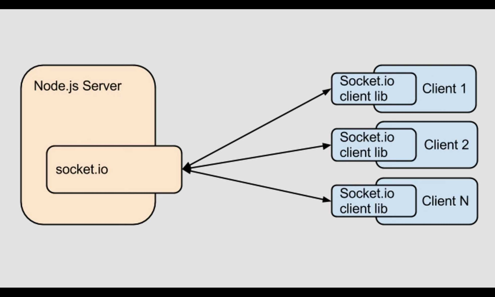

# socket_io_client

해당 자료는 개발시 필요한 정보를 위한 보충 설명이다

- express(backend framwork)와 flutter(frontend framwork)간 two way networking을 위해 socket io를 사용하였고 각 유저가 앱을 사용한다면 lib파일 안의 내용을 express 서버의 socket io 로직을 통해 데이터를 주고 받는다. 방을 만든 데이터는 방 참여를 위해 지속적일 필요가 있으므로 데이터베이스를 구축하였고 빠른 개발을 위해 웹브라우저를 이용한 mongoDB를 사용하였다.

## 주의

socket.io와 socket_io_colient간 버전의 호환성이 중요하다. [자세히](https://pub.dev/packages/socket_io_client)
