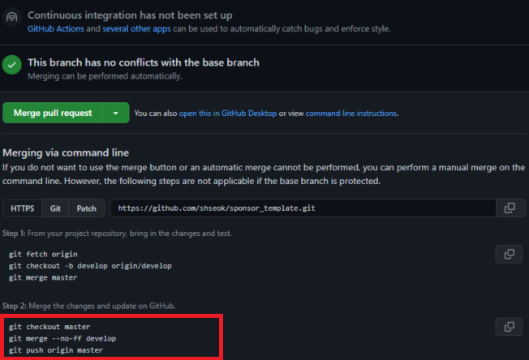
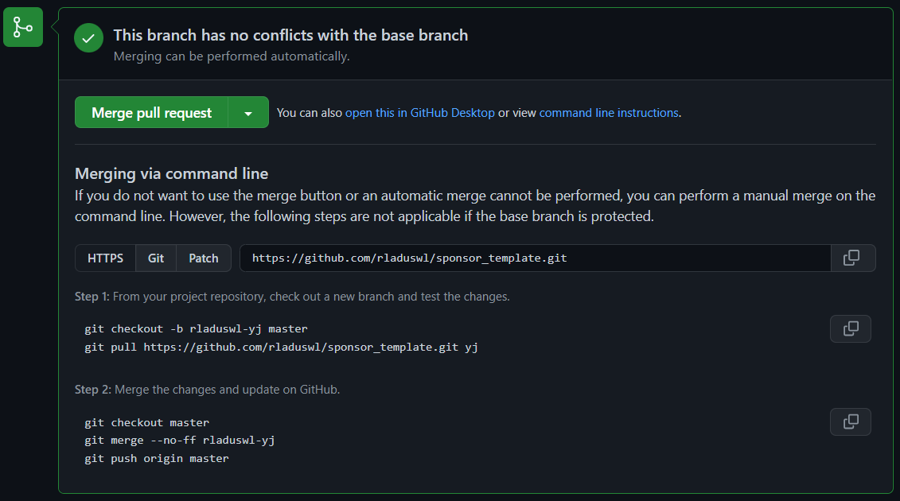
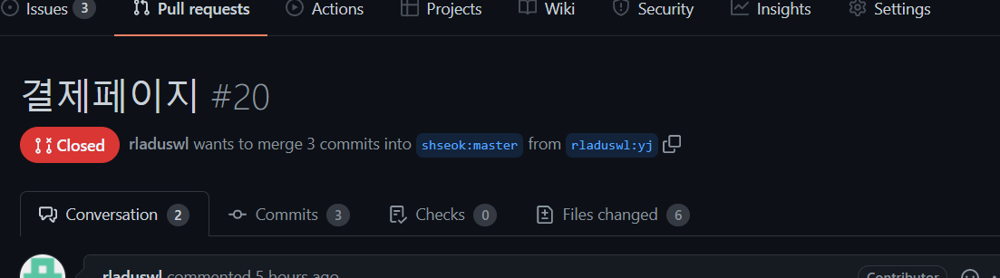

# Pull Request(PR)

## 원격 관리자

원격관리자입장에서 PR을 받으면 아래와 같이 Merge pull request버튼으로 바로 Merge를 누를 수 있다. (단, conflict가 없을시)

하지만, link로 open this in GitHub Desktop / command line instructions가 보인다. 에디터를 이용하여 디버그를 하기위해 두번째 방법을 사용할 것이다.

📌 master로 바로 push 하지말고 브랜치만들어서 PR하고 merge하는 습관! - 브랜치를 만들어 PR하면 유저가 PR할 때처럼 Compare & pull reqeust 버튼이 활성화된다. 활성화가 안되면 pull request창가서 branch를 바꿔줘서 진행한다.

📌 conflict 날 때, command line 도움받아서 에디터에서 작업하기

1. 원격 관리자 PR

오픈소스에서 자신의 프로젝트에 변경사항을 적용해주기 위해 필요 (master에 원격 관리자는 push하는 습관을 줄여야 한다.)

위 사진은 원격 관리자가 develop 브랜치를 만들어 수정 후 commit하고 PR을 진행한 과정이다. conflict는 없어 보인다.

이때, 프로젝트 진행중인 에디터에서 사용하므로 step1은 필요없다.

- step1은 새로운 프로젝트 repository를 만들었을 때, 진행해준다.

master로 develop 브랜치를 merge할 것이므로 step2를 진행해준다. 이후 push까지 완료해주면 해당 PR은 merged상태가 된다.

2. 외부에서 PR

외부에서 PR을 보낼시 원격 저장소에서 conflict가 발생했든 안했든 command line을 본다.

- step1
  - `git checkout -b <new_branch> [<start point>]`
    - 예시를 참고하자면 PR요청한깃헙 계정을 의미하는 rladuswl-yj로 새로운 브랜치를 만들고 이동
  - `git pull <repository> <refspec>`
    - rladuswl-yj계정에서 work branch인 yj 브랜치의 커밋들을 가져온다.
    - 이를통해 rladuswl-yj계정이 yj 브랜치를 만들고 그곳에서 작업하여 rladuswl-yj fork repository에 push한 것을 알 수 있다
- step2

  - 마스터로 가서 merge
    - merge한 기록(commit)을 남기지 않고 싶으면 fast forward로 보통 진행하지만, 기록을 남기고 싶다면 --no-ff
  - 관리자원격에 push하면 비로소 pr merge가 잘 된다.

- 위의 step을 따르지 않고 나의 로직
  1. 에디터에서 develop 브랜치로 변경 후 작업을 진행해준다. 2. `git pull https://github.com/hyeondevel/sponsor_template.git edit-readme` command line step에서 보여주는 pull방식을 이용하여 branch에 가져와 충돌이 난 것이든 아닌 것이든 적용한다. - 이때, master 에서 바로 checkout해서 merge해주면 안된다. 반드시 commit 후 checkout이 된다. 그렇지 않을경우 아래의error가 발생하였다. - error: you need to resolve your current index first 와 같은 error 발생 3.이를 master에서 merge 후 push하면 PR이 merged된 상태가 되어 마무리된다.

💡 관리자가 원격에서 받은 pr에 대해 merge 작업 중, pr을 보낸 계정(팀원)이 pr을 보낸 work branch를 fork repository에서 삭제할 경우 pr이 github에서 closed상태로 변한다. 이때, 관리자가 (에디터에서) 먼저 merge를 진행하고 있는 중이라면 상관없다. 관리자가 정상적으로 merge후 push하면 pr보낸 계정의 수정사항 commit은 정상적으로 포함되기 때문이다. 하지만, 관리자가 pr을 확인하지 못한 상태에서 pr을 보낸 계정이 fork repository의 pr branch를 삭제하게 되면, closed되어 관리자가 merge를 할 수 없는 상황이 된다. 따라서, 관리자가 merge했다고 알림을 주거나 항시 관리자페이지에서 pr section에가서 자신의 pr이 merge되었는지 확인하고 삭제하도록한다

- pr보낸 work branch를 fork repository에서 삭제하는 방법
- 위의 예시에서 `git push origin --delete yj`

## 팀원 or PR 이용자

1. 원하는 소스 fork
2. 자신으로부터 fork된 프로젝트 에디터로 clone (HTTPs or SSH)
3. 에디터에서 개발할 branch 생성
4. 해당 branch에서 수정 후 push는 origin으로
5. github에서 자동으로 create PR이 생기거나 PR창으로 가서 PR하기
6. 원격관리자가 merged 해주면 에디터에서 branch 삭제
7. 에디터에서 git remote add upstream {fork한 프로젝트 clone 주소(HTTPs or SSH)}
8. 항상 브랜치 생성 후 작업하려고 하지말고 git pull upstream master해서 업데이트 시켜준다.

📌 항상 PR 보내려고 에디터에서 코드 수정할 때, branch 만들고 시작하기!

📌 branch 만들고 바로 작성하려고 하지말고 원격 저장소 변경사항이 없는지 pull로 업데이트 해주기!

- [Pull Request(PR) 보내는 방법](https://chanhuiseok.github.io/posts/git-3/)
- [원격저장소의 최신 커밋 내역을 업데이트](https://chanhuiseok.github.io/posts/git-2/)
- [pull request 생활코딩](https://www.youtube.com/watch?v=uvsz2XgRPfM&list=PLuHgQVnccGMBXv1OKe3Hn3Jq6F735-uWm)
- [https://www.youtube.com/watch?v=9FZaYz0s8s4&t=412s](라매 개발자의 PR1)

# Code Review

- 코드 리뷰는 PR통해 할 수 있다. 리뷰 상황이 중요한 이유는 이 리뷰 상황에 따라 머지를 할지 하지 않을지 결정하는 확인절차 중 하나이기 때문이다.

1. 협업을 진행하면서 팀원들이 PR을 할 것이다. 단, PR을 할 때, 우측에 Reviews를 선택할 수 있다. 이는 현재 Pull Request(PR)을 리뷰를 해 줄 팀원을 지정하는 것이다.

   - PR을 만듦과 동시에 Reviewers를 지정해주면 그 사람에게 메일로 알림도 갈 것이다.
   - 만약, 내가 Reviews라면 비로소 Code Review를 할 수 있다.

2. PR의 File Changed를 클릭 -> [자세히](https://devlog-wjdrbs96.tistory.com/231)

3. setting의 branch 관리에서 리뷰 approch를 받아야 merge를 할 수 있도록 설정도 가능하다.

# github actions

[자세히](https://meetup.toast.com/posts/286)

# github pages

## 방법

- settings -> pages에서 source 를 선택하여 호스트되게 만들 수 있다.
- [자세히](https://wepplication.github.io/programming/github-pages/)
- [자세히](https://ya-ya.tistory.com/14)

# gitlab에서 github으로 프로젝트 가져오기 (미러링)

1. github settings - developer settings - personal access token (repo check 후 생성)
2. gitlab에서 가져올 레포지토리로가서 settings - repository - mirroring repositories - expand
   - Git repository URL에 github에서 new repo로 만든 주소 적용 (단, https://shseok@github.com/shseok/smart-safety-system.git 이런식으로 username위치 변경)
3. password에 github에서 발급받은 token을 넣어준다
4. morror repository 버튼 클릭 후 새로고침 버튼 클릭하면 github에 gitlab의 모든 정보(commit 포함)들이 올라간다

- [자세히](https://worldforest9.tistory.com/287)

# github에서 수정 후 pull이 아닌 fetch로 가지고 오기 (fetch의 유용성)

- 1.[fetch & branch -r & fetch내역](https://chaeyoung2.tistory.com/43)
  - fetch는 원격저장소에서 파일을 병합하기 전에 병합을 할지 말지 **확인**을 할수 있는 명령어이다.
  - [git branch 옵션](https://jistol.github.io/vcs/2017/01/27/git-branch/)
    - git branch -r : 원격 저장소의 브랜치 명을 볼 수 있다.
- 2.[fetch & pull, pull은 이제 그만](https://merrily-code.tistory.com/124)

# github action을 통한 TIL README file 자동화

- [참고](https://intrepidgeeks.com/tutorial/github-action-simplifies-the-automation-of-til-readme-updates)
