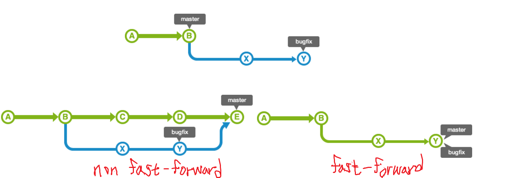
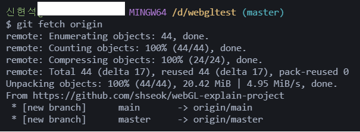
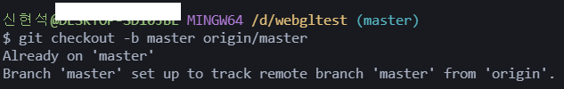

# Git

- 파일의 변경사항을 추적하기 위해 쓰임
- 형상관리를 위해 만들어짐
- 유닉스 계열은 모두 파일로 구성되어 있어서 vi ~/.gitconfig 로 기본 설정을 볼 수 있다.

- --global을 붙여주면 .git에 config파일이 수정됨
- git status를 할 때 현재 디렉토리에서 .git을 찾고 없으면 윗 디렉토리에서 발견할 때(home디렉토리까지)까지 찾는다.
- gitlab에서 소스관리(git) ,이슈 관리, 위키, 코드품질리뷰, 변경이력관리, 릴리즈관리, CI/CD 모두 제공.
- .gitignore에 파일이 크고 자주 바뀌는 것을 넣어놓으면 안된다.
- directory에 어떠한 파일도 존재하지 않을경우 commit이 안된다.
- Repository : project의 revision, history를 유지 관리하기 위한 모든 정보를 보관된다.
    - commit 단위로 저장
    - commit -> 보관할 가치가 있는 한 단위
    - repository로 저장 (local)
- [Object storage](https://storycompiler.tistory.com/7)
    - .git/objects에 개별적인 파일들로 존재
    - type
        - commit
        - tree
        - Blob
        - tag
### [세가지 상태](https://git-scm.com/book/ko/v2/%EC%8B%9C%EC%9E%91%ED%95%98%EA%B8%B0-Git-%EA%B8%B0%EC%B4%88)
- Modified
    - 수정한 파일을 아직 로컬 데이터베이스에 커밋하지 않은 것을 말한다.
- Staged
    - 현재 수정한 파일을 곧 커밋할 것이라고 표시한 상태를 의미한다.
- Committed
    - 데이터가 로컬 데이터베이스에 안전하게 저장됐다는 것을 의미한다.
### 세가지 단계
- Staging Area
    - Git 디렉토리에 있다. 
    - 단순한 파일이고 곧 커밋할 파일에 대한 정보를 저장한다.
- Working Directory
    - 작업 공간
    - 프로젝트의 특정 버전을 Checkout 한 것이다.
- Git Directory (.git)
    - Repository라고도 불린다.
    - 다른 컴퓨터에 있는 저장소를 Clone 할 때 Git 디렉토리가 만들어진다.
    - commit한 상태들이 모여있는 곳

### 기본 프로세스
1. 워킹 트리에서 파일을 수정한다.

2. Staging Area에 파일을 Stage 해서 커밋할 스냅샷을 만든다. 모든 파일을 추가할 수도 있고 선택하여 추가할 수도 있다.

3. Staging Area에 있는 파일들을 커밋해서 Git 디렉토리에 영구적인 스냅샷으로 저장한다.

# Git Command
- commit
    - ``$ git commit -a -m "{message}"``
        - "add + commit을 한번에 하겠다"
- diff
    - ``$ git diff``
        - "add이전인 not staged 변경된 사항을 확인하겠다"

    - ``$ git diff --staged``
        - "add이후인 staged but not commit 변경된 사항을 확인하겠다"
    - ``$ git diff branchB...branchA``
- [reset](https://www.lainyzine.com/ko/article/git-reset-and-git-revert-and-git-commit-amend/)
    - ``$ git reset HEAD <file>``
        - "staged 상태에서 unstaged 상태로 변경하겠다" (git add 하기 이전)
    - ``$ git reset --hard {SHA}``
        - --hard는 왠만하면 쓰지않는게 좋다
        - "모든 파일이 reset된 commit 상태로 돌아가게 할 것이다"
        - 현재 HEAD에서 추가된 변경사항들을 모두 되돌려주지만, Git 저장소에서 관리 하지 않는 파일들(Untracked files)을 추가한 경우 이 파일들은 reset 이후에도 그대로 유지된다. 이때, 해당 파일들도 삭제하기위해 git clean을 사용하면 된다.
        - ``$ git reset --hard HEAD^``
            - 바로 이전 커밋 상태로 되돌릴 때, 커밋 아이디를 정확히 지정하는 대신 HEAD^, HEAD@{1}, HEAD~1과 같은 표현을 사용할 수도 있다.
- clean
    - ``$ git clean -n``
        - 삭제 대상(Untracked files) 목록 확인
    - ``$ git clean -f``
        - Untracked files 파일 삭제
- log
    - ``$ git log --oneline``
    - ``$ git log branchB...branchA``
- revert
    - ``$ git revert <SHA>``
        - git reset은 HEAD 위치를 바꿔버려서, 로컬 저장소의 상태를 커밋 이전 상태로 강제 변경한다. 이는 위험하다. 특정 커밋의 내용을 commit으로 추가해 되돌리고 싶을 때 revert가 사용된다.
- checkout
    - ``$ git checkout -- {file}``
        - unstaged 상태에서 working directory에 있는 것을 이전(최근커밋된 버젼)으로 되돌라고 싶을 때. 
        - 즉, add하기 이전의 변화한 것을 변화하기 이전으로 바꾸는 과정이다.
        - 수정한 내용은 전부 사라지므로 위험한 명령이다. 조심히 사용하기!
            - 변경한 내용을 쉽게 버릴수는 없고 하지만 당장은 되돌려야만 하는 상황이라면 **Stash와 Branch**를 사용해야한다.
- commit
    - ``$ git commit -m "commit message"``
    - ``$ git commit -amend``
        - 커밋 내용을 덮어쓰고 싶거나(수정할 내용을 스테이징에 반영) 커밋 메시지 작성을 다시하기 위해 쓰인다. 
- tag
    - 특정 커밋에 태그를 추가한다. 보통 릴리즈할 때 사용한다(v1.0, 등). 커밋과 달리 태그는 수정이 불가능 하며, 따라서 읽기전용 커밋같은 개념이다.
    - ``$ git tag <tagname>``
        - 태그 추가
    - ``$ git tag``
        - 태그 목록 확인
    - ``$ git log --decorate``
        - 태그 정보를 포함한 이력확인
    - ``$ git tag -am "누구나 쉽게 이해할 수 있는 Git 입문" banana``
        - 주석달린 태그 추가
    - ``$ git tag -n``
        - 태그 목록과 주석확인
    - ``$ git tag -d <tagname>``
        - 태그 삭제

- -----------------------------------------------👇 수정하기
- git show [SHA]
- git reset --hard [SHA]
- git stash
    - staged상태의 것들이 stack에 쌓임
    - 보통 수정하고 보관하고 싶은게 있을때 사용
        - 작업을 변경하고 있는 중 상사가 작업 변경 전의 파일을 보내달라고 할 때 git stash 하면 기존 변경된 작업을 stack에 쌓고 변경 이전 상태로 
            
    - 그럼 commit 되기 이전 상태까지 모두 stash에 넣는건가?? 
    - 근데 왜 stack 구조와 반대로 쌓이지??
    - git stash list
    - git stash show
        - git stash show [num]
    - git stash drop [num]

- git push
    - push뒤에 아무것도 안쓰면 전체 브랜치를 원격에 보냄
- branch
    - main에서 수정하고 unstaged 상태로 다른 브랜치로 이동하면 수정한 파일을 볼 수 있다. (untracked 때문)
    - main에서 수정한 파일을 staged 상태로 변경 후 다른 브랜치로 이동하면 수정한 파일을 볼 수 없다. (갱신)
- merge
    - merge 이후 commit

- Your branch is ahead of 'origin/main' by 1 commit.
    - 가장 최근에 push이후 commit 안한게 있다.
    - git log 했을 때 HEAD가 origin/main보다 1개 앞에 있을 것임

- 완료한 commit을 취소해야 할 때가 있다. | 너무 일찍 commit한 경우 | 어떤 파일을 빼먹고 commit한 경우 이때, ``git reset HEAD^`` 명령어를 통해 git commit을 취소할 수 있다.

- git checkout -b {브랜치명}
    - 새로운 브랜치 생성 후 이동

- git remote
    - 삭제 : git remote rm {삭제할 remote명}
    - 이름변경 : git remote rename {변경할 remote명} {변경될 remote명}

### Merge pull reques
~한 일이 일어났다는 사실을 알 수 있음 (지저분할 수 있다)
### Squash and merge
보기 좋게 조작
- 브랜치의 하나의 버젼을 마스터에 병합
### Rebase and merge
보기 좋게 조작
- 한줄로 마스터에 브랜치 병합
### [merge와 rebase 차이](https://backlog.com/git-tutorial/kr/stepup/stepup1_4.html)

## fast-foward
Merge한 커밋을 남기지 않고 병합 가능하다.
- merge한 시점의 기록은 안보임
- fast-forward vs non fast-forward
    -  
- [자세히](https://backlog.com/git-tutorial/kr/stepup/stepup1_4.html)
### 병합종류
1. 보통의 병합 (--ff)
2. 이기적 병합 (--no-ff)
3. 소심한 병합 (--ff-only)
4. 양아치 병합 (--squash)

### fetch
원격 저장소의 데이터를 로컬에 가져오기만 하기
- 즉, 단순히 원격 저장소의 내용을 확인만 하고 로컬 데이터와 병합은 하고 싶지 않은 경우
- [자세히](https://backlog.com/git-tutorial/kr/stepup/stepup3_2.html)
- github에 master branch에 있는 것을 main branch로 합치는 상황(여기서는 master가 기타 branch 역할)
    - 새로운 directory 생성 -> git fetch origin
    -  

        - 원격에서 데이터를 가져오고 origin/master 포인터의 위치를 최신 커밋으로 이동시킨다. [노트 밑 내용 참고](https://git-scm.com/book/ko/v2/Git-%EB%B8%8C%EB%9E%9C%EC%B9%98-%EB%A6%AC%EB%AA%A8%ED%8A%B8-%EB%B8%8C%EB%9E%9C%EC%B9%98)
    -  

        - 원격의 master브랜치를 새 master 브랜치로 만들고 만든 브랜치로 이동한다.
        - origin/master 에서 시작하고 수정할 수 있는 master라는 로컬 브랜치가 만들어진다.

## gitignore
[버전관리 수행중이 파일 작성시 방법](https://kyu9341.github.io/Git/2020/08/23/git_gitignore/)

## Ref
- [GIT CHEAT SHEET](https://education.github.com/git-cheat-sheet-education.pdf)
- [GIT KR](https://git-scm.com/book/ko/v2)
