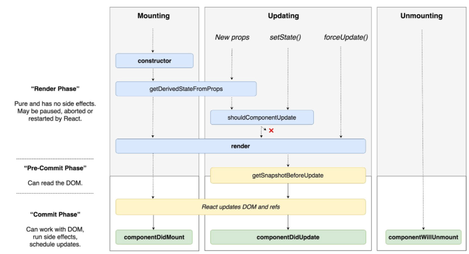

# LifeCycle API
클래스형 컴포넌트에서만 사용 할 수 있다.

- Mounting
    - 컴포넌트가 브라우저 상에 나타날 때 (= 해당 컴포넌트가 생성되서 사용자에게 보여지기까지의 전체과정)
    - React 컴포넌트가 실제 DOM에 삽입 된다는 의미이다.
- Updating
    - 컴포넌트의 props, status가 바뀌었을 때, 업데이트 (이미 mount가 되어있는 컴포넌트가 특정한 경우에 다시 렌더링되어야 하는 과정)
        - 📌 forceUpdate()는 강제적 렌더링해야할 경우 쓰이는데 보통 사용되지 않는다. (사용을 지양)
- Unmounting
    - 컴포넌트가 브라우저 상에서 사라질 때

# LifeCycle Method
- [componentDidMount()](https://ko.reactjs.org/docs/react-component.html#componentdidmount)
    - 컴포넌트가 처음 장착되었을 때, 컴포넌트가 처음 로딩될 때 내부의 코드를 실행해라 
    - 예) 리스트에 특정 아이템들을 출력하려고 할때 특정 아이템들이 서버에 존재한다면, 서버에가서 데이터를 읽어오는 작업이 필요하다. 해당 뿌려진 데이터들이 state에 있는 데이터라면 서버에서 읽어오는 작업을 한다.
- componentDidUpdate()
    - 컴포넌트 안에 무언가가 update되었을 때(ex. data 변경) 내부의 코드를 실행해라
- componentWillUnmount()
    - 컴포넌트에 장착한 것이 해체되기 바로 전에 코드를 실행해라
    - 해당 컴포넌트가 [EventListener](../JavaScript/EventListener.md) 달고 있어서 삭제해줘야하는 경우, 특정 resource를 가지고 있는데 반환(해제)해야하는 경우 쓰인다.
# Ref
- https://twitter.com/dan_abramov/status/981712092611989509
- https://www.youtube.com/watch?v=pPeiYFyHtr0&t=1s