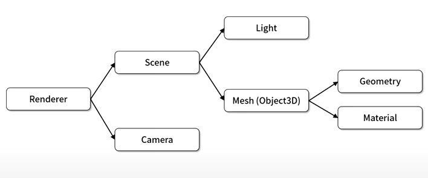

# Tree.js란?

웹에서 3차원 그래픽 기능 개발을 위한 자바스크립트 라이브러리

# 개발환경구성
1. vscode download
2. three.js download
    - 압축풀었을 때, three.js-master라는 파일 생성 -> build폴더로 이동
        - three.js
            - 일반적인 라이브러리 버전
        - three.min.js
            - three.js의 압축 버전
        - three.module.js
            - 모듈 방식으로 개발할 수 있는 라이브러리 버전
    - docs폴더
        - three.js의 개발자 api문서
        - 한국어 설명
    - **examples폴더**
        - three.js라이브러리의 예제코드
        - 좋은 코드
3. Live Server download
    - vscode extension
    - 개념: 개발을 위한 웹서버이다
        - 웹페이지가 웹서버를 통해서 접근할 수 있도록 해야 하는데, 이는 URL형태로 접근 가능
    - 기능: 파일 업데이트를 감지하여 자동으로 브라우저를 라이브 리로드 해준다

# Tree.js의 기본 구성 요소

3차원 객체로 구성되는 장면(Scene)이 존재
- Light
    - 3차원 형상이 화면상에 표시되기위해 필요한 광원
- Mesh(Object3D의 파생 클래스) - 3차원 모델
    - Geometry
        - 형상을 정의
    - Material
        - 색상 및 투명도 정의

Scene을 모니터에 출력할 수 있는 Renderer가 존재
시점에 따라 다양하게 볼 수 있게 해주는 Camera 존재
